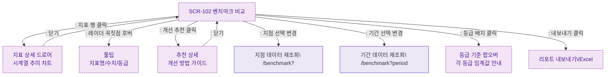

## 다이어그램

```mermaid
flowchart TD
    SCR102[SCR-102 벤치마크 비교]

    SCR102 -->|": 지표 행 클릭"|MetricDetail[지표 상세 드로어\n시계열 추이 차트]
    SCR102 -->|": 레이더 꼭짓점 호버"|Tooltip[툴팁\n지표명/수치/등급]
    SCR102 -->|": 개선 추천 클릭"|SuggestDetail[추천 상세\n개선 방법 가이드]
    SCR102 -->|": 지점 선택 변경"|BranchSwitch[지점 데이터 재조회\ /benchmark?]
    SCR102 -->|": 기간 선택 변경"|PeriodSwitch[기간 데이터 재조회\ /benchmark?period]
    SCR102 -->|": 등급 배지 클릭"|GradeInfo[등급 기준 팝오버\n각 등급 임계값 안내]
    SCR102 -->|": 내보내기 클릭"|Export[리포트 내보내기\/Excel]

    MetricDetail -->|": 닫기"|SCR102
    SuggestDetail -->|": 닫기"|SCR102

    classDef screen fill:#E3F2FD,stroke:#1976D2,color:#0D47A1
    classDef newFeature fill:#F3E5F5,stroke:#7B1FA2,color:#4A148C,stroke-dasharray:4 2
    classDef system fill:#EDE7F6,stroke:#5E35B2
    class SCR102 newFeature
    class MetricDetail,Tooltip,SuggestDetail,GradeInfo,Export newFeature
    class BranchSwitch,PeriodSwitch system
```

## TC 후보
- TC-102-002: 지표 행 클릭 → 시계열 추이 드로어 표시
