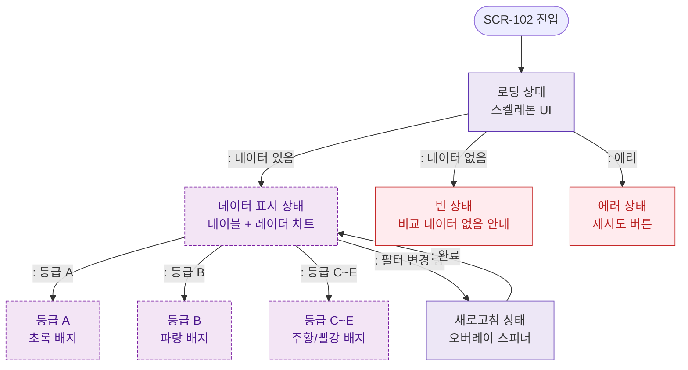

## 다이어그램

```mermaid
flowchart TD
    Entry([SCR-102 진입]) --> Loading[로딩 상태\n스켈레톤 UI]
    Loading -->|": 데이터 있음"|Populated[데이터 표시 상태\n테이블 + 레이더 차트]
    Loading -->|": 데이터 없음"|Empty[빈 상태\n비교 데이터 없음 안내]
    Loading -->|": 에러"|ErrorState[에러 상태\n재시도 버튼]

    Populated -->|": 등급 A"|GradeA[등급 A\n초록 배지]
    Populated -->|": 등급 B"|GradeB[등급 B\n파랑 배지]
    Populated -->|": 등급 C~E"|GradeCE[등급 C~E\n주황/빨강 배지]

    Populated -->|": 필터 변경 중"|Refreshing[새로고침 상태\n오버레이 스피너]
    Refreshing -->|": 완료"|Populated

    classDef screen fill:#E3F2FD,stroke:#1976D2,color:#0D47A1
    classDef newFeature fill:#F3E5F5,stroke:#7B1FA2,color:#4A148C,stroke-dasharray:4 2
    classDef error fill:#FFEBEE,stroke:#C62828,color:#B71C1C
    classDef system fill:#EDE7F6,stroke:#5E35B2
    class Populated,GradeA,GradeB,GradeCE newFeature
    class ErrorState,Empty error
    class Loading,Refreshing system
```
