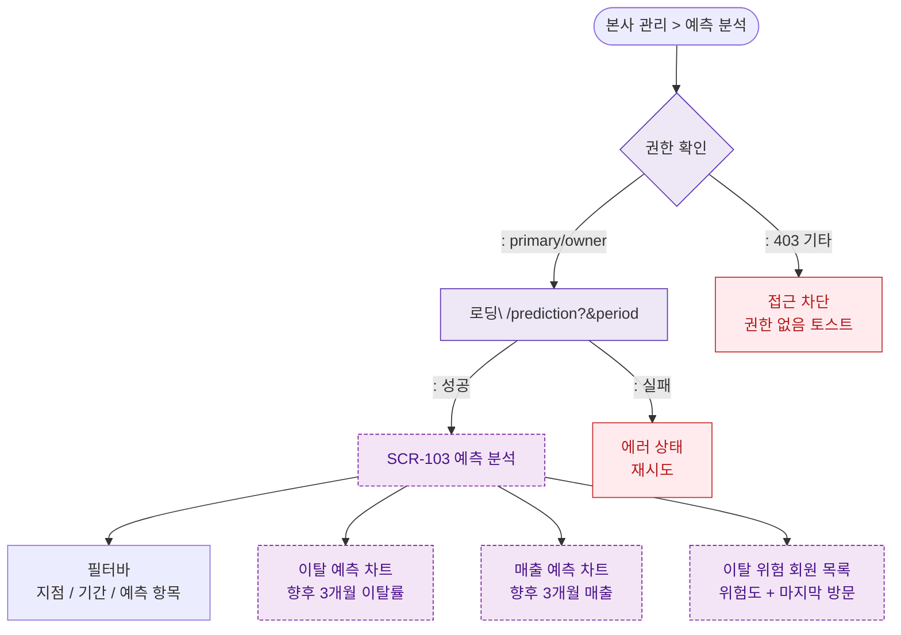

## 다이어그램

```mermaid
flowchart TD
    Sidebar([본사 관리 > 예측 분석]) --> Auth{권한 확인}
    Auth -->|": primary/owner"|Loading[로딩\ /prediction?&period]
    Auth -->|": 403 기타"|Blocked[접근 차단\n권한 없음 토스트]

    Loading -->|": 성공"|SCR103[SCR-103 예측 분석\n]
    Loading -->|": 실패"|ErrorState[에러 상태\n재시도]

    SCR103 --> FilterBar[필터바\n지점 / 기간 / 예측 항목]
    SCR103 --> ChurnChart[이탈 예측 차트\n향후 3개월 이탈률]
    SCR103 --> RevenueChart[매출 예측 차트\n향후 3개월 매출]
    SCR103 --> RiskList[이탈 위험 회원 목록\n위험도 + 마지막 방문]

    classDef screen fill:#E3F2FD,stroke:#1976D2,color:#0D47A1
    classDef newFeature fill:#F3E5F5,stroke:#7B1FA2,color:#4A148C,stroke-dasharray:4 2
    classDef error fill:#FFEBEE,stroke:#C62828,color:#B71C1C
    classDef system fill:#EDE7F6,stroke:#5E35B2
    class SCR103 newFeature
    class ChurnChart,RevenueChart,RiskList newFeature
    class ErrorState,Blocked error
    class Loading,Auth system
```

## TC 후보
- TC-103-001: 본사 관리 > 예측 분석 진입 → 이탈 예측 + 매출 예측 차트 표시
