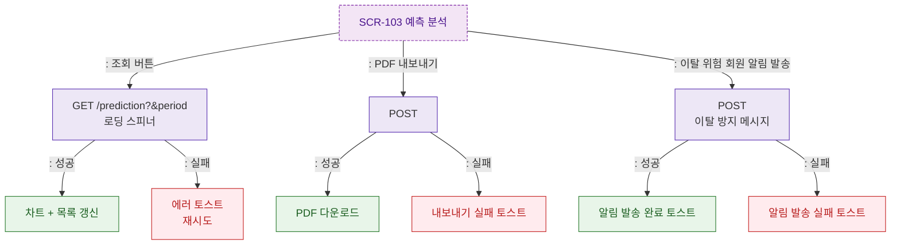

## 다이어그램

```mermaid
flowchart TD
    SCR103[SCR-103 예측 분석]

    SCR103 -->|": 조회 버튼"|Fetch[GET /prediction?&period\n로딩 스피너]
    Fetch -->|": 성공"|ChartRefresh[차트 + 목록 갱신]
    Fetch -->|": 실패"|FetchErr[에러 토스트\n재시도]

    SCR103 -->|": PDF 내보내기"|ExportPDF[POST]
    ExportPDF -->|": 성공"|PDFDown[PDF 다운로드]
    ExportPDF -->|": 실패"|ExportErr[내보내기 실패 토스트]

    SCR103 -->|": 이탈 위험 회원 알림 발송"|NotifyReq[POST \n이탈 방지 메시지]
    NotifyReq -->|": 성공"|NotifyOK[알림 발송 완료 토스트]
    NotifyReq -->|": 실패"|NotifyErr[알림 발송 실패 토스트]

    classDef screen fill:#E3F2FD,stroke:#1976D2,color:#0D47A1
    classDef newFeature fill:#F3E5F5,stroke:#7B1FA2,color:#4A148C,stroke-dasharray:4 2
    classDef success fill:#E8F5E9,stroke:#2E7D32,color:#1B5E20
    classDef error fill:#FFEBEE,stroke:#C62828,color:#B71C1C
    classDef system fill:#EDE7F6,stroke:#5E35B2
    class SCR103 newFeature
    class ChartRefresh,PDFDown,NotifyOK success
    class FetchErr,ExportErr,NotifyErr error
    class Fetch,ExportPDF,NotifyReq system
```

## TC 후보
- TC-103-003: 이탈 위험 회원 알림 발송 → 발송 완료 토스트
