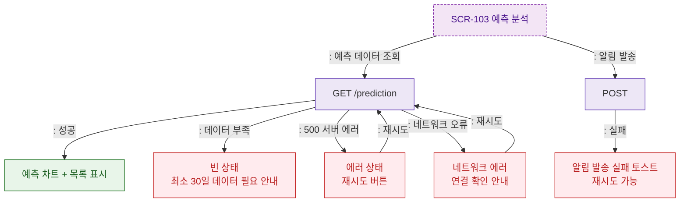

## 다이어그램

```mermaid
flowchart TD
    SCR103[SCR-103 예측 분석]

    SCR103 -->|": 예측 데이터 조회"|DataReq[GET /prediction]
    DataReq -->|": 성공"|DataOK[예측 차트 + 목록 표시]
    DataReq -->|": 데이터 부족"|E_Insufficient[빈 상태\n최소 30일 데이터 필요 안내]
    DataReq -->|": 500 서버 에러"|E_Server[에러 상태\n재시도 버튼]
    DataReq -->|": 네트워크 오류"|E_Network[네트워크 에러\n연결 확인 안내]

    E_Server -->|": 재시도"|DataReq
    E_Network -->|": 재시도"|DataReq

    SCR103 -->|": 알림 발송"|NotifyReq[POST]
    NotifyReq -->|": 실패"|E_Notify[알림 발송 실패 토스트\n재시도 가능]

    classDef screen fill:#E3F2FD,stroke:#1976D2,color:#0D47A1
    classDef newFeature fill:#F3E5F5,stroke:#7B1FA2,color:#4A148C,stroke-dasharray:4 2
    classDef success fill:#E8F5E9,stroke:#2E7D32,color:#1B5E20
    classDef error fill:#FFEBEE,stroke:#C62828,color:#B71C1C
    classDef system fill:#EDE7F6,stroke:#5E35B2
    class SCR103 newFeature
    class DataOK success
    class E_Insufficient,E_Server,E_Network,E_Notify error
    class DataReq,NotifyReq system
```

## TC 후보
- TC-103-NEG-002: 데이터 부족 상태 → 빈 상태 화면 + 안내 메시지 표시
