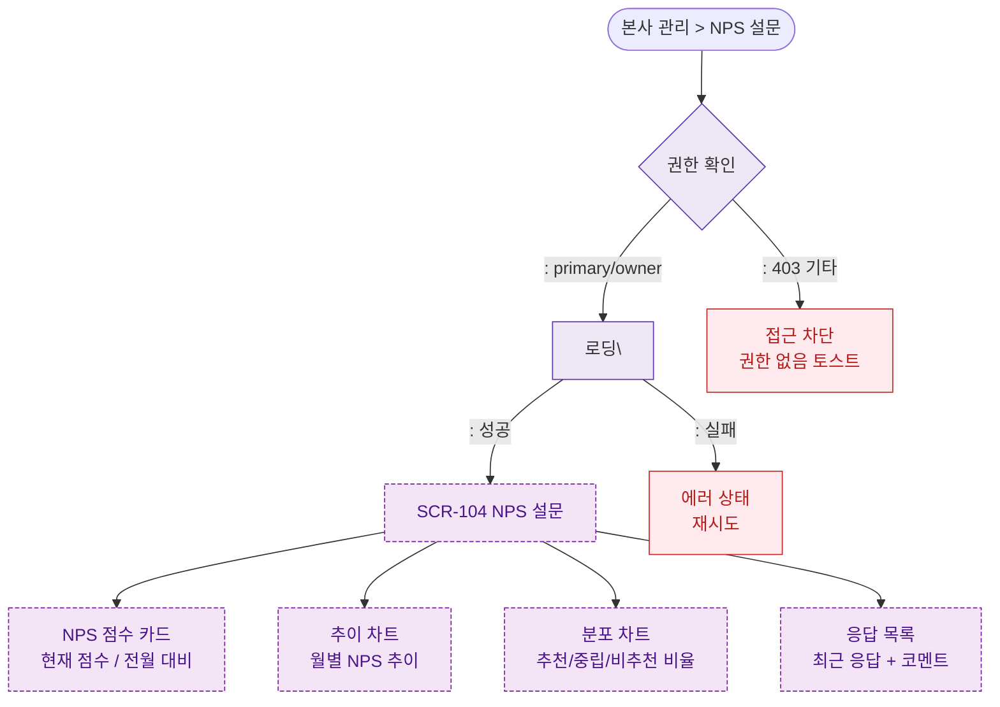

## 다이어그램

```mermaid
flowchart TD
    Sidebar([본사 관리 > NPS 설문]) --> Auth{권한 확인}
    Auth -->|": primary/owner"|Loading[로딩\]
    Auth -->|": 403 기타"|Blocked[접근 차단\n권한 없음 토스트]

    Loading -->|": 성공"|SCR104[SCR-104 NPS 설문\n]
    Loading -->|": 실패"|ErrorState[에러 상태\n재시도]

    SCR104 --> ScoreCard[NPS 점수 카드\n현재 점수 / 전월 대비]
    SCR104 --> TrendChart[추이 차트\n월별 NPS 추이]
    SCR104 --> DistChart[분포 차트\n추천/중립/비추천 비율]
    SCR104 --> ResponseList[응답 목록\n최근 응답 + 코멘트]

    classDef screen fill:#E3F2FD,stroke:#1976D2,color:#0D47A1
    classDef newFeature fill:#F3E5F5,stroke:#7B1FA2,color:#4A148C,stroke-dasharray:4 2
    classDef error fill:#FFEBEE,stroke:#C62828,color:#B71C1C
    classDef system fill:#EDE7F6,stroke:#5E35B2
    class SCR104 newFeature
    class ScoreCard,TrendChart,DistChart,ResponseList newFeature
    class ErrorState,Blocked error
    class Loading,Auth system
```

## TC 후보
- TC-104-001: 본사 관리 > NPS 설문 진입 → NPS 점수 카드 + 추이 차트 표시
