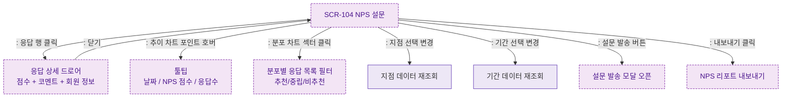

## 다이어그램

```mermaid
flowchart TD
    SCR104[SCR-104 NPS 설문]

    SCR104 -->|": 응답 행 클릭"|ResponseDetail[응답 상세 드로어\n점수 + 코멘트 + 회원 정보]
    SCR104 -->|": 추이 차트 포인트 호버"|Tooltip[툴팁\n날짜 / NPS 점수 / 응답수]
    SCR104 -->|": 분포 차트 섹터 클릭"|DistFilter[분포별 응답 목록 필터\n추천/중립/비추천]
    SCR104 -->|": 지점 선택 변경"|BranchSwitch[지점 데이터 재조회]
    SCR104 -->|": 기간 선택 변경"|PeriodSwitch[기간 데이터 재조회]
    SCR104 -->|": 설문 발송 버튼"|SendSurvey[설문 발송 모달 오픈]
    SCR104 -->|": 내보내기 클릭"|Export[NPS 리포트 내보내기]

    ResponseDetail -->|": 닫기"|SCR104

    classDef screen fill:#E3F2FD,stroke:#1976D2,color:#0D47A1
    classDef newFeature fill:#F3E5F5,stroke:#7B1FA2,color:#4A148C,stroke-dasharray:4 2
    classDef system fill:#EDE7F6,stroke:#5E35B2
    class SCR104 newFeature
    class ResponseDetail,Tooltip,DistFilter,SendSurvey,Export newFeature
    class BranchSwitch,PeriodSwitch system
```

## TC 후보
- TC-104-002: 응답 행 클릭 → 응답 상세 드로어 표시
