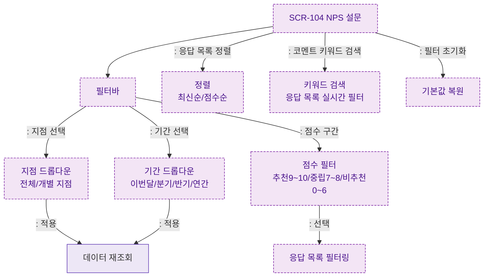

## 다이어그램

```mermaid
flowchart TD
    SCR104[SCR-104 NPS 설문]

    SCR104 --> FilterBar[필터바]
    FilterBar -->|": 지점 선택"|BranchFilter[지점 드롭다운\n전체/개별 지점]
    FilterBar -->|": 기간 선택"|PeriodFilter[기간 드롭다운\n이번달/분기/반기/연간]
    FilterBar -->|": 점수 구간"|ScoreFilter[점수 필터\n추천9~10/중립7~8/비추천0~6]

    BranchFilter -->|": 적용"|Reload[데이터 재조회]
    PeriodFilter -->|": 적용"|Reload
    ScoreFilter -->|": 선택"|ListFilter[응답 목록 필터링]

    SCR104 -->|": 응답 목록 정렬"|SortList[정렬\n최신순/점수순]
    SCR104 -->|": 코멘트 키워드 검색"|SearchKeyword[키워드 검색\n응답 목록 실시간 필터]
    SCR104 -->|": 필터 초기화"|ResetFilter[기본값 복원]

    classDef screen fill:#E3F2FD,stroke:#1976D2,color:#0D47A1
    classDef newFeature fill:#F3E5F5,stroke:#7B1FA2,color:#4A148C,stroke-dasharray:4 2
    classDef system fill:#EDE7F6,stroke:#5E35B2
    class SCR104 newFeature
    class FilterBar,BranchFilter,PeriodFilter,ScoreFilter,ListFilter,SortList,SearchKeyword,ResetFilter newFeature
    class Reload system
```
