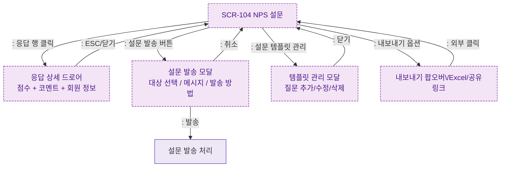

## 다이어그램

```mermaid
flowchart TD
    SCR104[SCR-104 NPS 설문]

    SCR104 -->|": 응답 행 클릭"|DrawerResponse[응답 상세 드로어\n점수 + 코멘트 + 회원 정보]
    SCR104 -->|": 설문 발송 버튼"|ModalSend[설문 발송 모달\n대상 선택 / 메시지 / 발송 방법]
    SCR104 -->|": 설문 템플릿 관리"|ModalTemplate[템플릿 관리 모달\n질문 추가/수정/삭제]
    SCR104 -->|": 내보내기 옵션"|PopoverExport[내보내기 팝오버\/Excel/공유링크]

    DrawerResponse -->|": ESC/닫기"|SCR104
    ModalSend -->|": 취소"|SCR104
    ModalSend -->|": 발송"|SendAction[설문 발송 처리]
    ModalTemplate -->|": 닫기"|SCR104
    PopoverExport -->|": 외부 클릭"|SCR104

    classDef screen fill:#E3F2FD,stroke:#1976D2,color:#0D47A1
    classDef newFeature fill:#F3E5F5,stroke:#7B1FA2,color:#4A148C,stroke-dasharray:4 2
    classDef system fill:#EDE7F6,stroke:#5E35B2
    class SCR104 newFeature
    class DrawerResponse,ModalSend,ModalTemplate,PopoverExport newFeature
    class SendAction system
```
