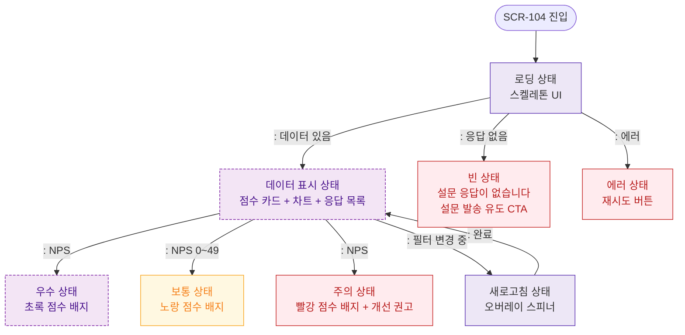

## 다이어그램

```mermaid
flowchart TD
    Entry([SCR-104 진입]) --> Loading[로딩 상태\n스켈레톤 UI]
    Loading -->|": 데이터 있음"|Populated[데이터 표시 상태\n점수 카드 + 차트 + 응답 목록]
    Loading -->|": 응답 없음"|Empty[빈 상태\n설문 응답이 없습니다\n설문 발송 유도 CTA]
    Loading -->|": 에러"|ErrorState[에러 상태\n재시도 버튼]

    Populated -->|": NPS"|HighScore[우수 상태\n초록 점수 배지]
    Populated -->|": NPS 0~49"|MidScore[보통 상태\n노랑 점수 배지]
    Populated -->|": NPS"|LowScore[주의 상태\n빨강 점수 배지 + 개선 권고]

    Populated -->|": 필터 변경 중"|Refreshing[새로고침 상태\n오버레이 스피너]
    Refreshing -->|": 완료"|Populated

    classDef screen fill:#E3F2FD,stroke:#1976D2,color:#0D47A1
    classDef newFeature fill:#F3E5F5,stroke:#7B1FA2,color:#4A148C,stroke-dasharray:4 2
    classDef success fill:#E8F5E9,stroke:#2E7D32,color:#1B5E20
    classDef warning fill:#FFF8E1,stroke:#F9A825,color:#F57F17
    classDef error fill:#FFEBEE,stroke:#C62828,color:#B71C1C
    classDef system fill:#EDE7F6,stroke:#5E35B2
    class Populated,HighScore newFeature
    class MidScore warning
    class LowScore,ErrorState,Empty error
    class Loading,Refreshing system
```
