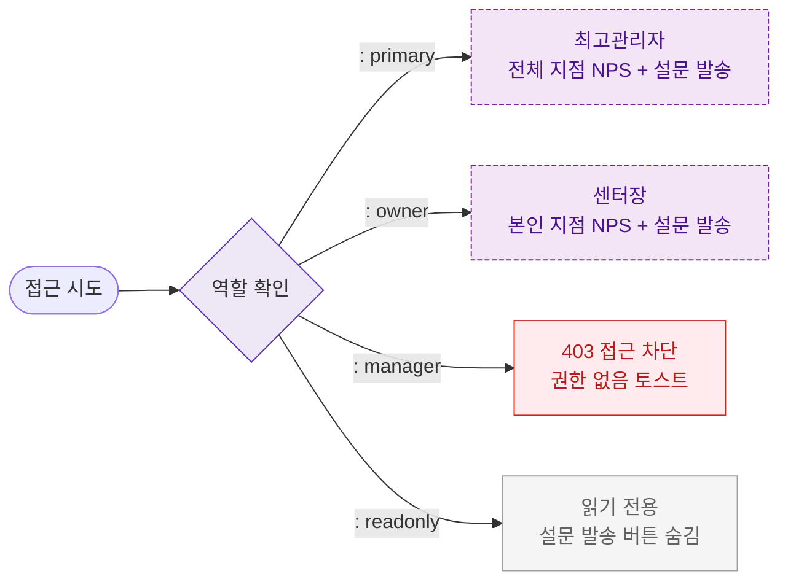

## 다이어그램

## 역할별 접근 매트릭스
| 역할 | 접근 | 전체 지점 | 설문 발송 | 내보내기 |
|------|:---:|:--------:|:--------:|:-------:|
| primary | ✅ | ✅ | ✅ | ✅ |
| owner | ✅ | 본인 지점만 | ✅ | ✅ |
| manager | ❌ | ❌ | ❌ | ❌ |
| fc | ❌ | ❌ | ❌ | ❌ |
| staff | ❌ | ❌ | ❌ | ❌ |
| readonly | ✅ | 본인 지점만 | ❌ | ❌ |

## TC 후보
- TC-104-NEG-001: manager 접근 시도 → 403 접근 차단
