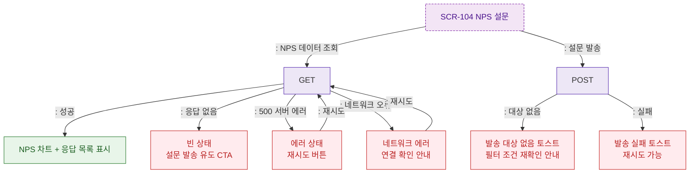

## 다이어그램

```mermaid
flowchart TD
    SCR104[SCR-104 NPS 설문]

    SCR104 -->|": NPS 데이터 조회"|DataReq[GET]
    DataReq -->|": 성공"|DataOK[NPS 차트 + 응답 목록 표시]
    DataReq -->|": 응답 없음"|E_Empty[빈 상태\n설문 발송 유도 CTA]
    DataReq -->|": 500 서버 에러"|E_Server[에러 상태\n재시도 버튼]
    DataReq -->|": 네트워크 오류"|E_Network[네트워크 에러\n연결 확인 안내]

    E_Server -->|": 재시도"|DataReq
    E_Network -->|": 재시도"|DataReq

    SCR104 -->|": 설문 발송"|SendReq[POST]
    SendReq -->|": 대상 없음"|E_NoTarget[발송 대상 없음 토스트\n필터 조건 재확인 안내]
    SendReq -->|": 실패"|E_Send[발송 실패 토스트\n재시도 가능]

    classDef screen fill:#E3F2FD,stroke:#1976D2,color:#0D47A1
    classDef newFeature fill:#F3E5F5,stroke:#7B1FA2,color:#4A148C,stroke-dasharray:4 2
    classDef success fill:#E8F5E9,stroke:#2E7D32,color:#1B5E20
    classDef error fill:#FFEBEE,stroke:#C62828,color:#B71C1C
    classDef system fill:#EDE7F6,stroke:#5E35B2
    class SCR104 newFeature
    class DataOK success
    class E_Empty,E_Server,E_Network,E_NoTarget,E_Send error
    class DataReq,SendReq system
```

## TC 후보
- TC-104-NEG-002: 설문 발송 대상 없음 → 안내 토스트 표시
