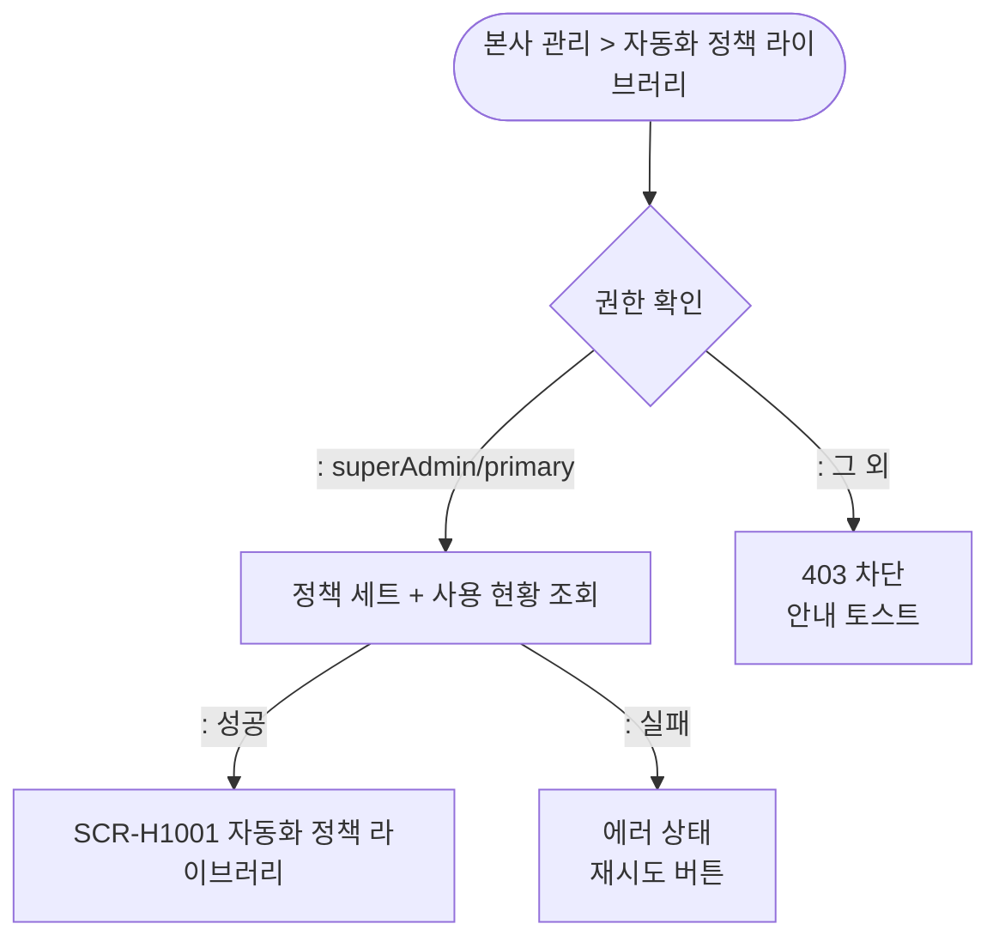

## 다이어그램

```mermaid
flowchart TD
    Sidebar([본사 관리 > 자동화 정책 라이브러리]) --> Auth{권한 확인}
    Auth -->|": superAdmin/primary"|Load[정책 세트 + 사용 현황 조회]
    Auth -->|": 그 외"|Blocked[403 차단
안내 토스트]

    Load -->|": 성공"|Screen[SCR-H1001 자동화 정책 라이브러리]
    Load -->|": 실패"|Error[에러 상태
재시도 버튼]
```

## TC 후보
- TC-H1001-F1-001: 허용 역할 진입 시 정책 세트 카드와 테이블이 로드된다.
- TC-H1001-F1-002: 비허용 역할은 403 차단된다.

