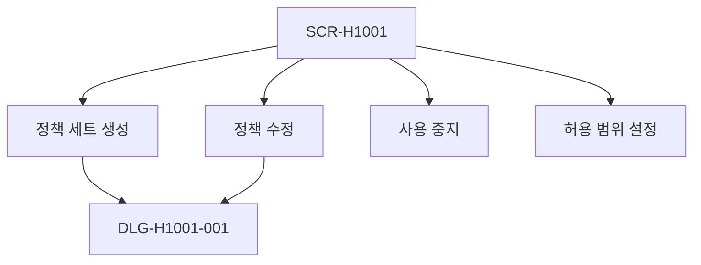

## 다이어그램

```mermaid
flowchart TD
    Screen[SCR-H1001] --> Create[정책 세트 생성]
    Screen --> Edit[정책 수정]
    Screen --> Stop[사용 중지]
    Screen --> Scope[허용 범위 설정]

    Create --> Dialog[DLG-H1001-001]
    Edit --> Dialog
```

## TC 후보
- TC-H1001-F3-001: 생성/수정 버튼에서 DLG-H1001-001이 열린다.

