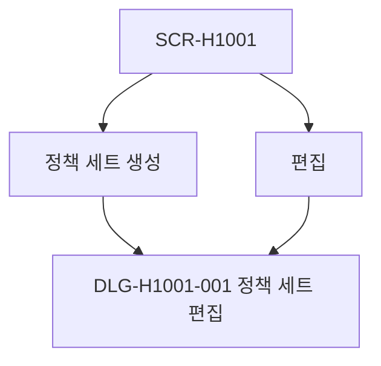

## 다이어그램

```mermaid
flowchart TD
    Screen[SCR-H1001] --> Create[정책 세트 생성]
    Screen --> Edit[편집]
    Create --> Dialog[DLG-H1001-001 정책 세트 편집]
    Edit --> Dialog
```

## TC 후보
- TC-H1001-F5-001: 카드/테이블 액션에서 정책 세트 편집 다이얼로그가 열린다.

