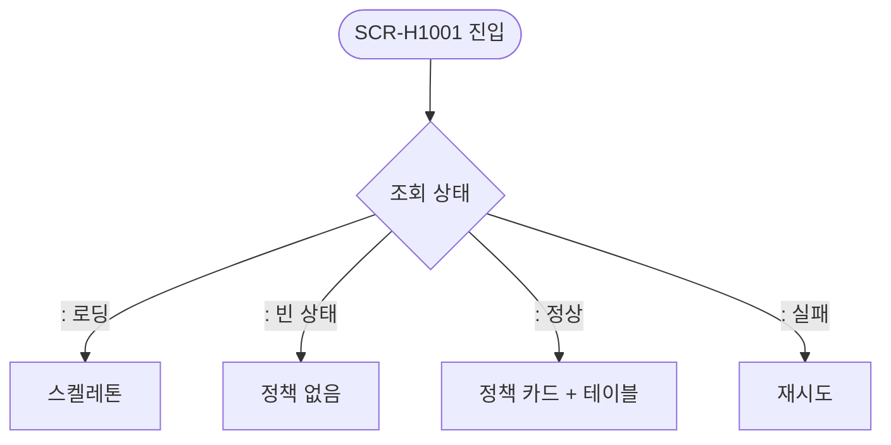

## 다이어그램

```mermaid
flowchart TD
    Entry([SCR-H1001 진입]) --> State{조회 상태}
    State -->|": 로딩"|Loading[스켈레톤]
    State -->|": 빈 상태"|Empty[정책 없음]
    State -->|": 정상"|Ready[정책 카드 + 테이블]
    State -->|": 실패"|Error[재시도]
```

## TC 후보
- TC-H1001-F6-001: 빈 상태에서 정책 생성 CTA가 보인다.

