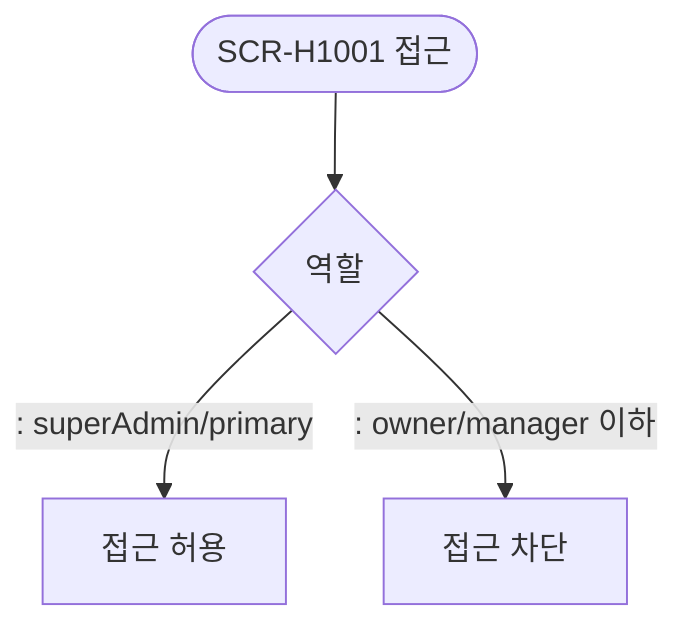

## 다이어그램

```mermaid
flowchart TD
    Entry([SCR-H1001 접근]) --> Role{역할}
    Role -->|": superAdmin/primary"|Allow[접근 허용]
    Role -->|": owner/manager 이하"|Block[접근 차단]
```

## TC 후보
- TC-H1001-F7-001: superAdmin/primary만 접근 가능하다.

