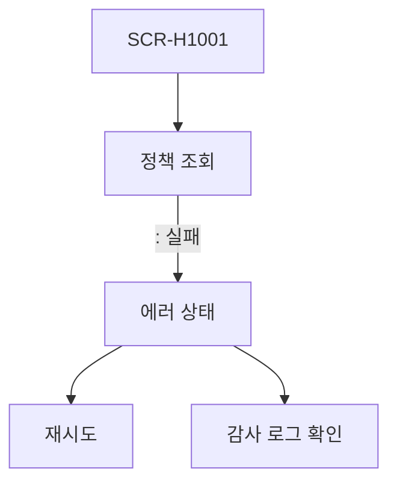

## 다이어그램

```mermaid
flowchart TD
    Screen[SCR-H1001] --> Load[정책 조회]
    Load -->|": 실패"|Error[에러 상태]
    Error --> Retry[재시도]
    Error --> Audit[감사 로그 확인]
```

## TC 후보
- TC-H1001-F8-001: 조회 실패 시 재시도 버튼이 제공된다.

