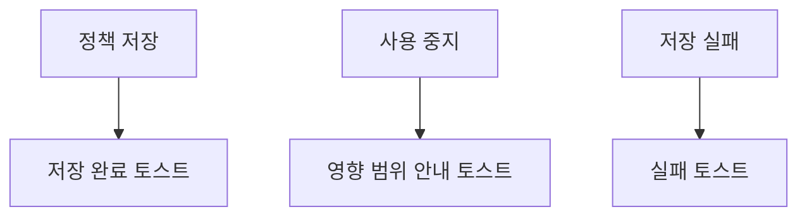

## 다이어그램

```mermaid
flowchart TD
    Save[정책 저장] --> Success[저장 완료 토스트]
    Stop[사용 중지] --> Warn[영향 범위 안내 토스트]
    Fail[저장 실패] --> Error[실패 토스트]
```

## TC 후보
- TC-H1001-F9-001: 저장/중지/실패 시 피드백 토스트가 다르게 노출된다.

