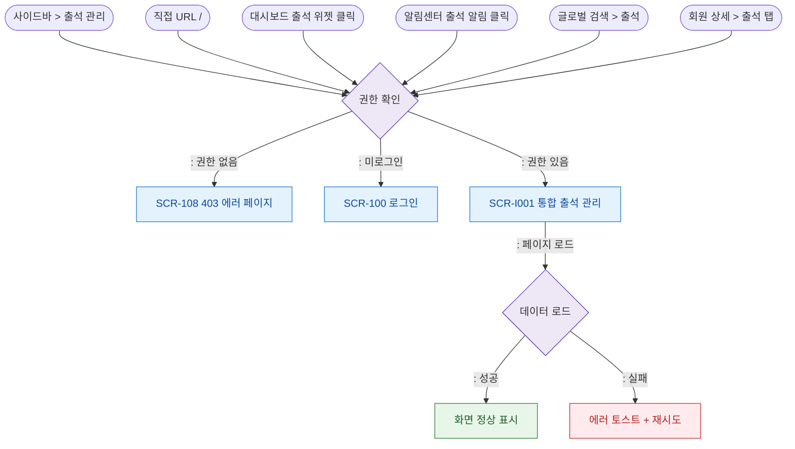

# F1 진입 플로우 — SCR-I001 통합 출석 관리

## 목적
통합 출석 관리 화면(`/`)으로 진입 가능한 모든 경로를 정의한다.

## 전제조건
- 로그인 세션 유효
- 출석 관리 메뉴 접근 권한 보유 ( 모두 가능)

## 다이어그램

## 엣지 설명

| 출발 | 도착 | 설명 |
|------|------|------|
| 사이드바 | Auth | 사이드바 메뉴 클릭 |
| 직접 URL | Auth | 브라우저 주소 직접 입력 |
| 대시보드 위젯 | Auth | 출석 위젯 클릭 |
| 알림센터 | Auth | 출석 관련 알림 클릭 (X30 참조) |
| 글로벌 검색 | Auth | 검색 결과에서 진입 |
| 회원 상세 | Auth | 회원 상세의 출석 탭 링크 |
| Auth | FORBIDDEN | 권한 없음 → 403 |
| Auth | LOGIN | 미로그인 → 로그인 리다이렉트 |
| Auth | SCR_I001 | 권한 있음 → 화면 진입 |
| SCR_I001 | LOAD | 출석 로그 데이터 로드 |
| LOAD | READY | 데이터 로드 성공 |
| LOAD | ERR | 데이터 로드 실패 |

## TC 후보

| TC ID | 타입 | Given | When | Then |
|-------|------|-------|------|------|
| TC-I001-F1-01 | positive | staff 로그인 | 사이드바 > 출석 관리 클릭 | 통합 출석 관리 화면 진입 |
| TC-I001-F1-02 | negative | 미로그인 | / 직접 접근 | 로그인 페이지 리다이렉트 |
| TC-I001-F1-03 | positive | manager 로그인 | 대시보드 출석 위젯 클릭 | 통합 출석 관리 화면 진입 |
| TC-I001-F1-04 | exception | 로그인 세션 | 데이터 로드 API 실패 | 에러 토스트 표시, 재시도 가능 |
