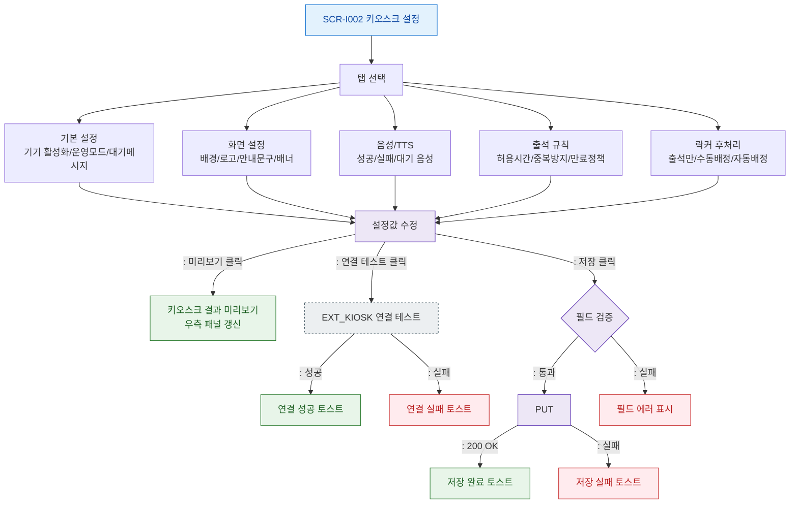

# F2 메인 인터랙션 플로우 — SCR-I002 키오스크 설정

## 목적
키오스크 설정 탭별 설정 수정 → 저장 → 미리보기 정상 흐름을 정의한다.

## 다이어그램

## TC 후보
| TC ID | 타입 | Given | When | Then |
|-------|------|-------|------|------|
| TC-I002-F2-01 | positive | owner | 락커 후처리 탭 > 자동배정 선택 후 저장 | 설정 저장, 저장 완료 토스트 |
| TC-I002-F2-02 | positive | owner | 미리보기 버튼 클릭 | 키오스크 결과 미리보기 갱신 |
| TC-I002-F2-03 | positive | owner | 연결 테스트 클릭 | 연결 성공/실패 토스트 |
| TC-I002-F2-04 | negative | owner | 필수 필드 비워두고 저장 | 필드 에러 표시 |
