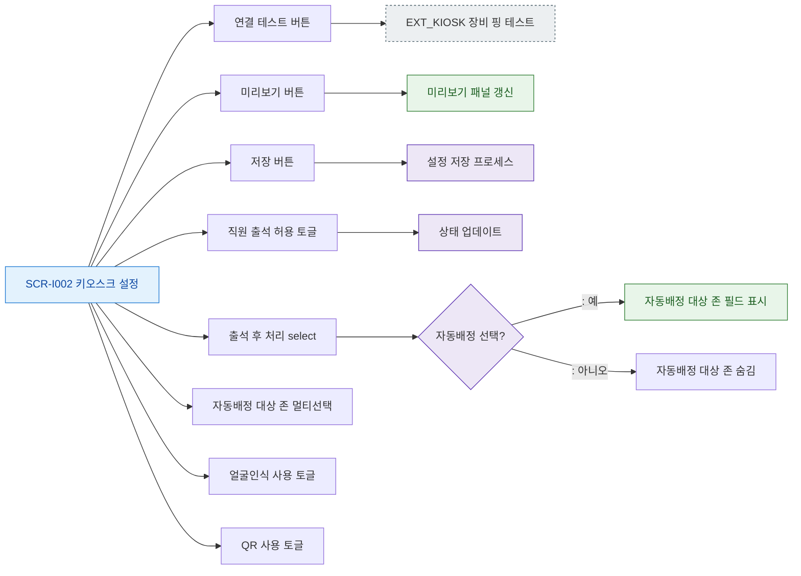

# F3 버튼/액션 매핑 플로우 — SCR-I002 키오스크 설정

## 다이어그램

## TC 후보
| TC ID | 타입 | Given | When | Then |
|-------|------|-------|------|------|
| TC-I002-F3-01 | positive | owner | 출석 후 처리 = 자동배정 선택 | 자동배정 대상 존 필드 표시 |
| TC-I002-F3-02 | positive | owner | 출석 후 처리 = 출석만 선택 | 자동배정 대상 존 필드 숨김 |
| TC-I002-F3-03 | positive | owner | 직원 출석 허용 토글 OFF | 상태 업데이트 |
