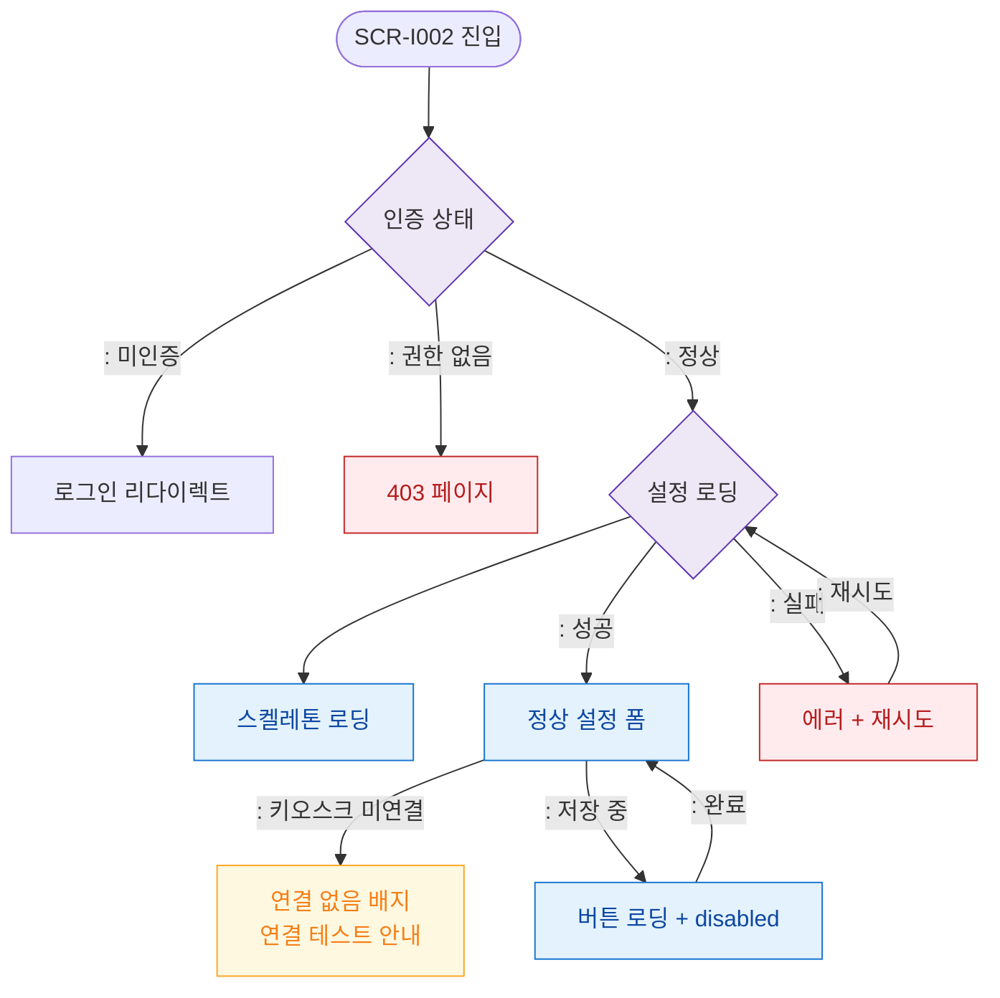

# F6 상태별 화면 플로우 — SCR-I002 키오스크 설정

## 다이어그램

## TC 후보
| TC ID | 타입 | Given | When | Then |
|-------|------|-------|------|------|
| TC-I002-F6-01 | positive | owner | 페이지 진입 | 스켈레톤 로딩 후 설정 폼 표시 |
| TC-I002-F6-02 | negative | manager | 접근 | 403 페이지 |
| TC-I002-F6-03 | negative | owner | 키오스크 미연결 상태 | 연결 없음 배지 표시 |
