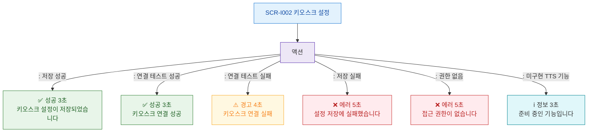

# F9 토스트/피드백 플로우 — SCR-I002 키오스크 설정

## 다이어그램

## TC 후보
| TC ID | 타입 | Given | When | Then |
|-------|------|-------|------|------|
| TC-I002-F9-01 | positive | owner | 설정 저장 성공 | 성공 토스트 3초 |
| TC-I002-F9-02 | positive | owner | 연결 테스트 성공 | 연결 성공 토스트 |
| TC-I002-F9-03 | negative | owner | 연결 테스트 실패 | 경고 토스트 4초 |
