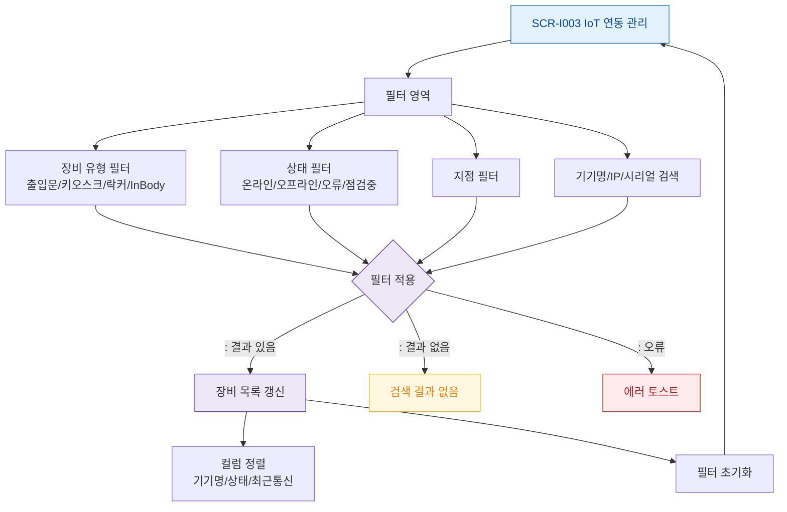

# F4 필터/검색 플로우 — SCR-I003 IoT 연동 관리

## 다이어그램

## TC 후보
| TC ID | 타입 | Given | When | Then |
|-------|------|-------|------|------|
| TC-I003-F4-01 | positive | owner | 상태 = 오류 필터 | 오류 장비만 표시 |
| TC-I003-F4-02 | positive | owner | 장비 유형 = InBody | InBody 장비만 표시 |
| TC-I003-F4-03 | positive | owner | 기기명 검색 | 검색어 포함 장비 표시 |
