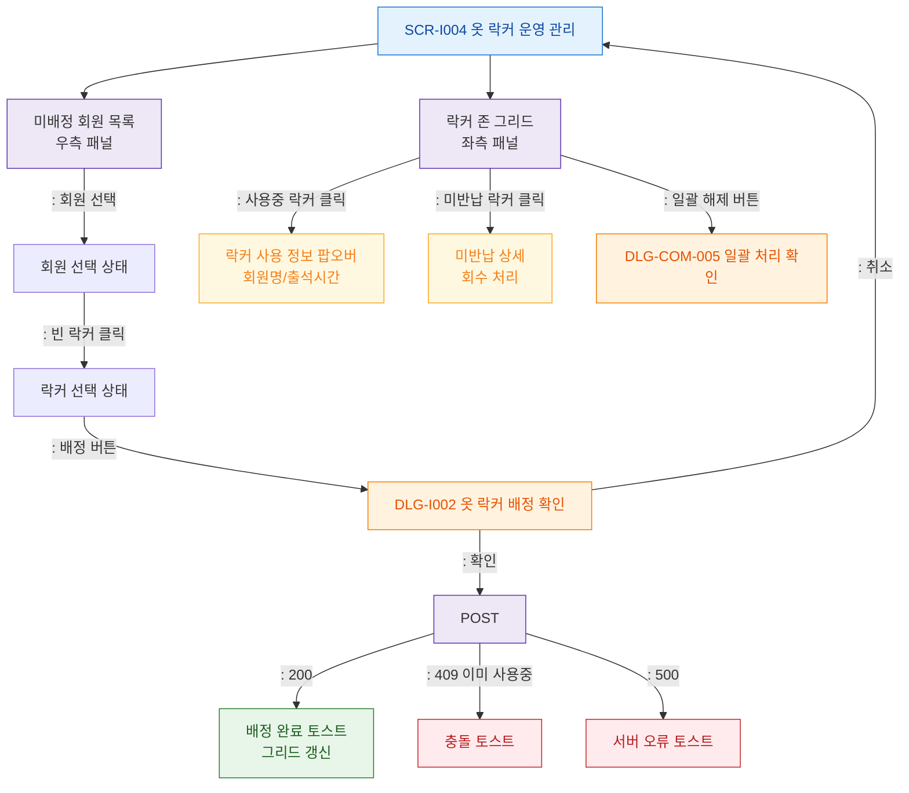

# F2 메인 인터랙션 플로우 — SCR-I004 옷 락커 운영 관리

## 목적
락커 그리드 → 미배정 회원 선택 → 락커 클릭 → 배정 정상 흐름을 정의한다.

## 다이어그램

## TC 후보
| TC ID | 타입 | Given | When | Then |
|-------|------|-------|------|------|
| TC-I004-F2-01 | positive | staff | 미배정 회원 선택 → 빈 락커 클릭 → 배정 | 배정 완료 토스트, 그리드 갱신 |
| TC-I004-F2-02 | negative | staff | 이미 사용중인 락커 배정 시도 | 409 충돌 토스트 |
| TC-I004-F2-03 | positive | manager | 일괄 해제 버튼 | DLG-COM-005 열림 |
| TC-I004-F2-04 | positive | staff | 사용중 락커 클릭 | 사용 정보 팝오버 표시 |
