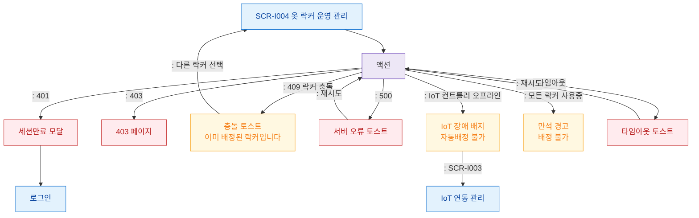

# F8 에러/예외/복구 플로우 — SCR-I004 옷 락커 운영 관리

## 다이어그램

## TC 후보
| TC ID | 타입 | Given | When | Then |
|-------|------|-------|------|------|
| TC-I004-F8-01 | negative | staff | 이미 배정된 락커 재배정 | 409 충돌 토스트 |
| TC-I004-F8-02 | negative | staff | IoT 컨트롤러 오프라인 | 장애 배지, 자동배정 불가 |
| TC-I004-F8-03 | negative | staff | 모든 락커 사용중 | 만석 경고 |
