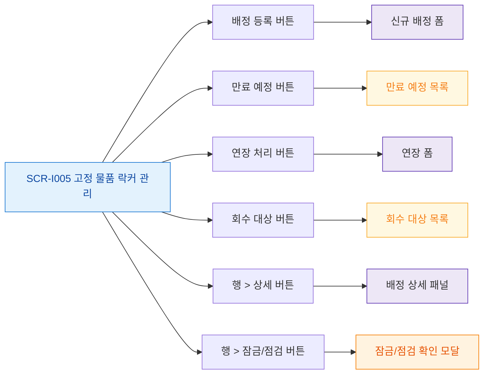

# F3 버튼/액션 매핑 — SCR-I005 고정 물품 락커 관리

## 다이어그램

## TC 후보
| TC ID | 타입 | Given | When | Then |
|-------|------|-------|------|------|
| TC-I005-F3-01 | positive | manager | 배정 등록 버튼 | 신규 배정 폼 표시 |
| TC-I005-F3-02 | positive | manager | 만료 예정 버튼 | D-7 이내 목록 표시 |
| TC-I005-F3-03 | positive | manager | 행 > 잠금/점검 | 잠금 확인 모달 표시 |
