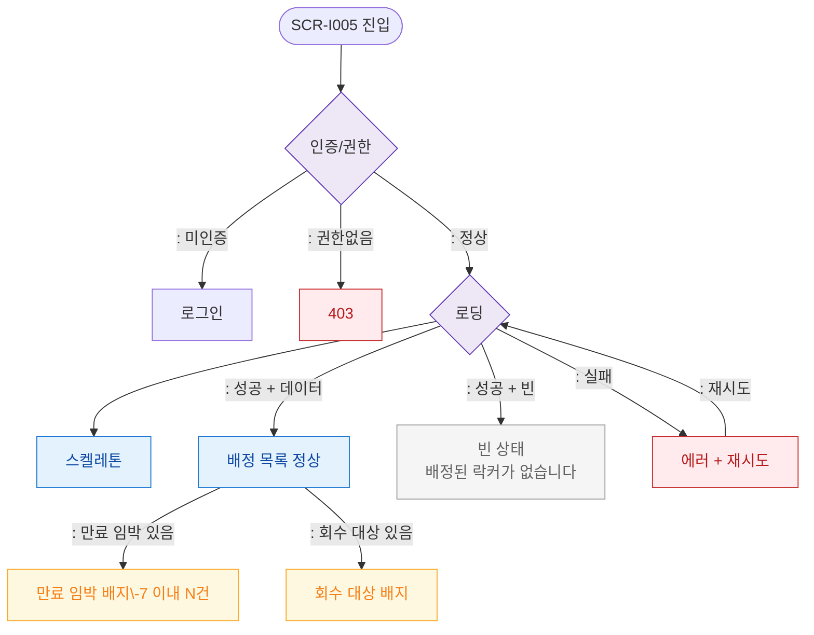

# F6 상태별 화면 플로우 — SCR-I005 고정 물품 락커 관리

## 다이어그램

## TC 후보
| TC ID | 타입 | Given | When | Then |
|-------|------|-------|------|------|
| TC-I005-F6-01 | positive | manager | 만료 임박 배정 있음 | 만료 임박 배지 표시 |
| TC-I005-F6-02 | positive | manager | 배정 없음 | 빈 상태 메시지 |
| TC-I005-F6-03 | negative | fc | 접근 | 403 |
