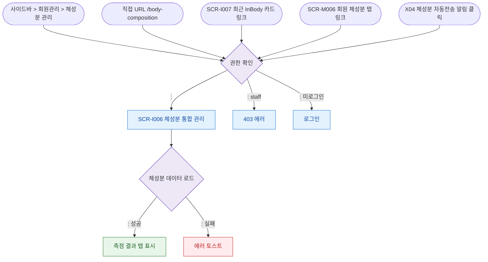

# F1 진입 플로우 — SCR-I006 체성분 통합 관리

## 다이어그램

## TC 후보
| TC ID | 타입 | Given | When | Then |
|-------|------|-------|------|------|
| TC-I006-F1-01 | positive | fc | 사이드바 > 체성분 관리 | 체성분 통합 관리 진입 |
| TC-I006-F1-02 | negative | staff | /body-composition 접근 | 403 에러 |
| TC-I006-F1-03 | positive | fc | X04 알림 클릭 | 체성분 통합 관리 진입 |
