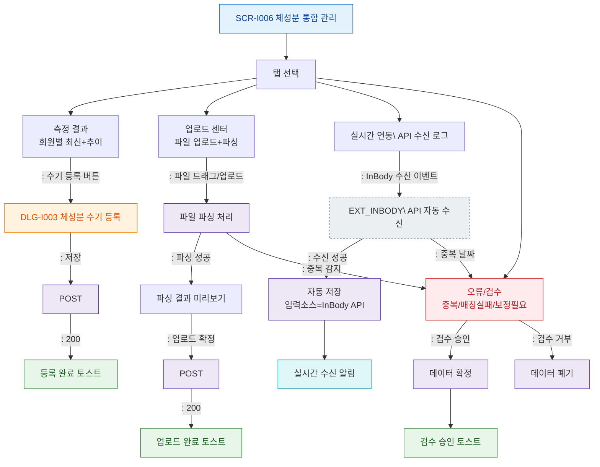

# F2 메인 인터랙션 플로우 — SCR-I006 체성분 통합 관리

## 목적
3개 수집 경로(수기/파일업로드/실시간API)와 탭별 흐름, 오류 검수 정상 경로를 정의한다.

## 다이어그램

## TC 후보
| TC ID | 타입 | Given | When | Then |
|-------|------|-------|------|------|
| TC-I006-F2-01 | positive | fc | 수기 등록 버튼 클릭 | DLG-I003 열림 |
| TC-I006-F2-02 | positive | fc | CSV 파일 업로드 | 파싱 결과 미리보기 표시 |
| TC-I006-F2-03 | positive | fc | InBody API 자동 수신 | 실시간 연동 탭에 수신 로그 추가 |
| TC-I006-F2-04 | negative | fc | 중복 날짜 수신 | 오류/검수 탭으로 이동 |
| TC-I006-F2-05 | positive | fc | 검수 승인 | 데이터 확정, 승인 토스트 |
