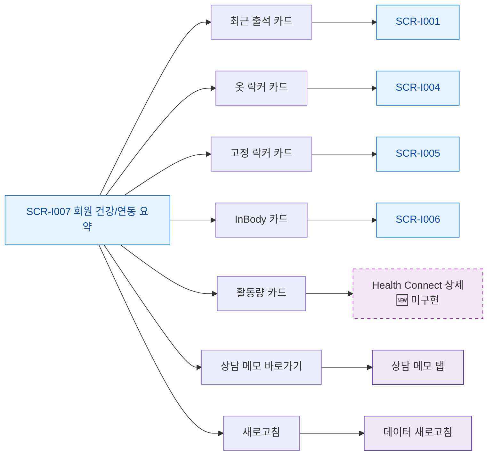

# F3 버튼/액션 매핑 — SCR-I007 회원 상세 건강/연동 요약

## 다이어그램

## TC 후보
| TC ID | 타입 | Given | When | Then |
|-------|------|-------|------|------|
| TC-I007-F3-01 | positive | fc | 최근 출석 카드 클릭 | SCR-I001 이동 |
| TC-I007-F3-02 | positive | fc | InBody 카드 클릭 | SCR-I006 이동 |
| TC-I007-F3-03 | positive | fc | 활동량 카드 클릭 | 미구현 안내 토스트 |
