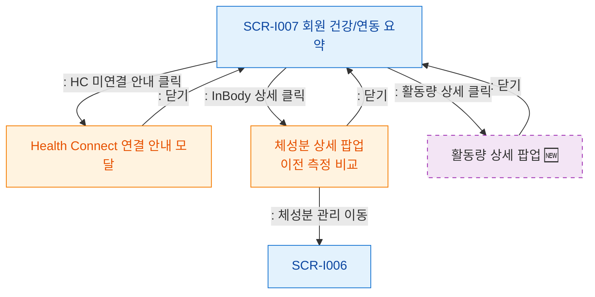

# F5 모달 트리거 트리 — SCR-I007 회원 상세 건강/연동 요약

## 다이어그램

## TC 후보
| TC ID | 타입 | Given | When | Then |
|-------|------|-------|------|------|
| TC-I007-F5-01 | positive | fc | HC 미연결 안내 클릭 | 연결 안내 모달 열림 |
| TC-I007-F5-02 | positive | fc | InBody 상세 클릭 | 체성분 상세 팝업 열림 |
