# N1. member (회원) 사이트맵

> 회원 모드(member) 전체 화면 구조. APP-IA v4.0 기준.

```mermaid
graph TD
    Login[MA-001 로그인] --> SignUp[MA-002 앱 가입/연동]
    Login --> Home[MA-100 회원 홈]

    SignUp --> Onboard1[MA-127 운동 온보딩 설문]
    Onboard1 --> Onboard2[MA-128 온보딩 완료/첫 루틴]
    Onboard2 --> Welcome[MA-900 환영 슬라이드]
    Welcome --> Home

    Home --> Attendance[출석]
    Home --> Reservation[예약]
    Home --> MyMembership[이용권/결제]
    Home --> Rewards[리워드]
    Home --> Notify[알림/설정]
    Home --> Market[MA-300 마켓 둘러보기]

    Attendance --> QR[MA-110 QR 체크인]
    Attendance --> History[MA-111 출석 이력]

    Reservation --> ClassList[MA-120 수업 목록]
    Reservation --> ClassDetail[MA-121 수업 상세/예약]
    Reservation --> MyReserve[MA-122 내 예약/수업 이력]
    Reservation --> Golf[MA-123 Golf 예약]
    Reservation --> Wait[MA-124 대기 예약]
    Reservation --> Trainer[MA-125 강사 상세]
    Reservation --> Review[MA-126 수업 후기]

    MyMembership --> Membership[MA-131 이용권/잔여 회차]
    MyMembership --> Payments[MA-133 결제 내역]
    MyMembership --> Store[MA-134 상품 스토어]
    MyMembership --> Recommend[MA-138 재등록 추천]
    MyMembership --> ProductDetail[MA-139 상품 상세]
    MyMembership --> Checkout[MA-140 결제하기]
    MyMembership --> Manual[MA-141 개인 결제]
    MyMembership --> Receipt[MA-142 영수증 상세]
    MyMembership --> Body[MA-132 체성분/FMS]

    Rewards --> Profile[MA-130 마이페이지]
    Rewards --> Coupon[MA-135 쿠폰함]
    Rewards --> Mileage[MA-136 리워드 센터]
    Rewards --> Badge[MA-137 배지 컬렉션]
    Rewards --> Grade[MA-500 멤버십 등급]
    Rewards --> Invite[MA-501 친구 초대]
    Rewards --> Activity[MA-502 활동 이력]

    Notify --> Notifications[MA-150 알림센터]
    Notify --> CenterInfo[MA-151 센터 정보]
    Notify --> Notice[MA-152 공지사항]
    Notify --> Inquiry[MA-153 1:1 문의]
    Notify --> Settings[MA-155 설정]
    Settings --> Terms[MA-156 약관/정책]
    Settings --> Consent[MA-157 동의관리]
    Settings --> Withdraw[MA-158 회원 탈퇴]
```

## 핵심 노드 설명

| 노드 | 역할 |
|---|---|
| MA-001 | 회원/직원 분기 진입점 |
| MA-100 | 회원 홈 — 모든 도메인 진입 허브 |
| MA-127/128 | 운동 온보딩 (1회) |
| MA-900 | 신규 회원 환영 (1회) |
| MA-300 | 마켓 둘러보기 (가입 외 센터 탐색) |
