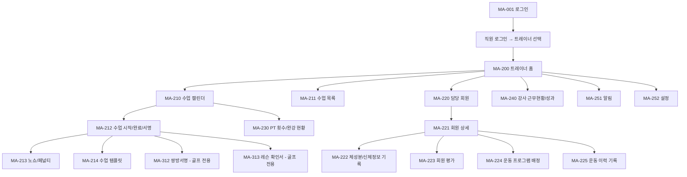

# N2. trainer / golf_trainer 사이트맵

> 트레이너·골프강사 모드. 직원 로그인 → 트레이너 선택 진입.

## 트레이너 vs 골프강사 차이

| 화면 | trainer | golf_trainer |
|---|---|---|
| MA-212 수업 완료/서명 | 강사 단독 서명 | 강사 + 회원 쌍방서명 (MA-312) |
| MA-313 레슨 확인서 | - | PDF 확인서 자동 생성 |
| MA-230 PT 횟수 | PT 잔여 | PT + 골프 레슨권 잔여 |
