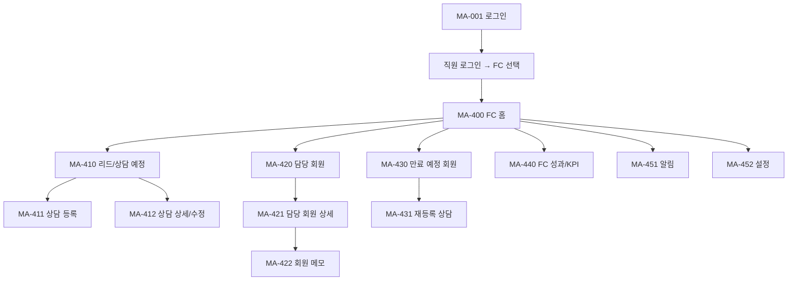
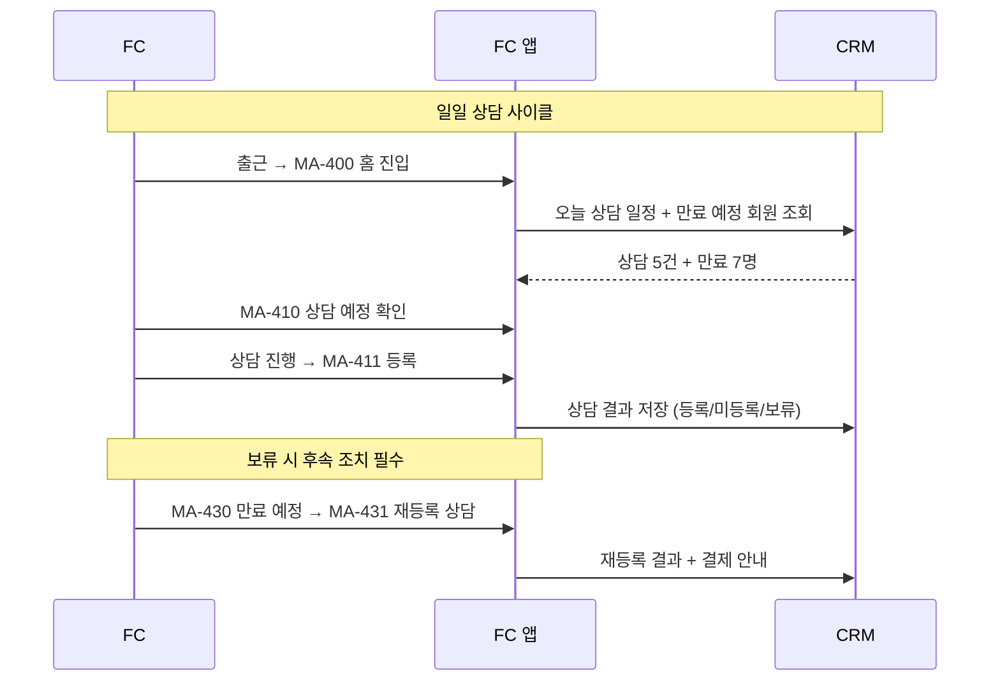

# N3. FC (Fitness Consultant) 사이트맵

> FC 모드. 직원 로그인 → FC 선택 진입.

```mermaid
graph TD
    Login[MA-001 로그인] --> SelectFC[직원 로그인 → FC 선택]
    SelectFC --> Home[MA-400 FC 홈]

    Home --> Lead[MA-410 리드/상담 예정]
    Home --> Members[MA-420 담당 회원]
    Home --> Expire[MA-430 만료 예정 회원]
    Home --> KPI[MA-440 FC 성과/KPI]
    Home --> Notify[MA-451 알림]
    Home --> Settings[MA-452 설정]

    Lead --> CounselRegister[MA-411 상담 등록]
    Lead --> CounselDetail[MA-412 상담 상세/수정]

    Members --> MemberDetail[MA-421 담당 회원 상세]
    MemberDetail --> Memo[MA-422 회원 메모]

    Expire --> Recounsel[MA-431 재등록 상담]
```

## FC 워크플로우

```mermaid
sequenceDiagram
    participant FC
    participant App as FC 앱
    participant CRM

    Note over FC,CRM: 일일 상담 사이클
    FC->>App: 출근 → MA-400 홈 진입
    App->>CRM: 오늘 상담 일정 + 만료 예정 회원 조회
    CRM-->>App: 상담 5건 + 만료 7명
    FC->>App: MA-410 상담 예정 확인
    FC->>App: 상담 진행 → MA-411 등록
    App->>CRM: 상담 결과 저장 (등록/미등록/보류)
    Note over FC,App: 보류 시 후속 조치 필수
    FC->>App: MA-430 만료 예정 → MA-431 재등록 상담
    App->>CRM: 재등록 결과 + 결제 안내
```
