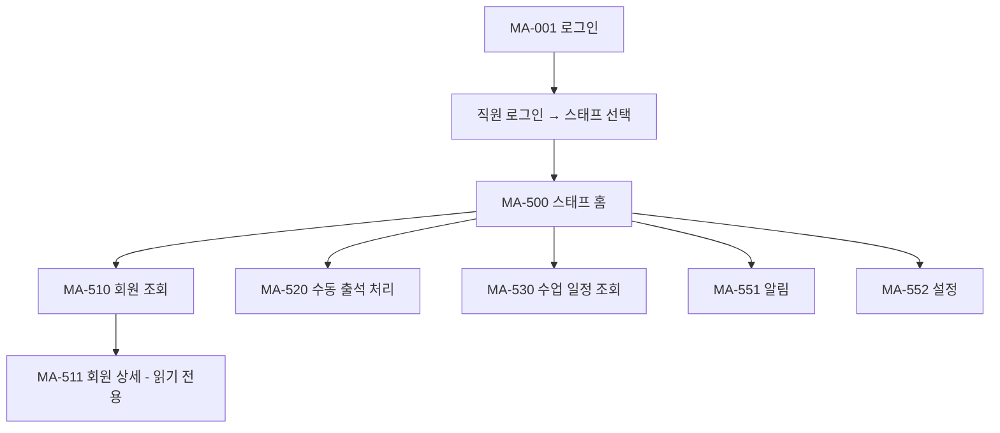
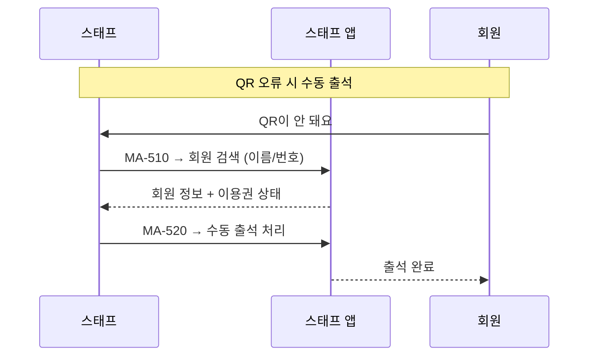

# N4. staff (스태프) 사이트맵

> 스태프 모드. 직원 로그인 → 스태프 선택 진입. 회원 조회 / 수동 출석 위주.

## 스태프 권한 제약

| 화면 | 동작 | 권한 |
|---|---|---|
| MA-510 / MA-511 회원 조회 | 조회만 | 읽기 전용 (수정 / 삭제 불가) |
| MA-520 수동 출석 | 회원 검색 → 수동 출석 처리 | 읽기 + 출석 기록 추가 |
| MA-530 수업 일정 | 전체 수업 조회 | 읽기 전용 |

## 스태프 이용 시나리오

