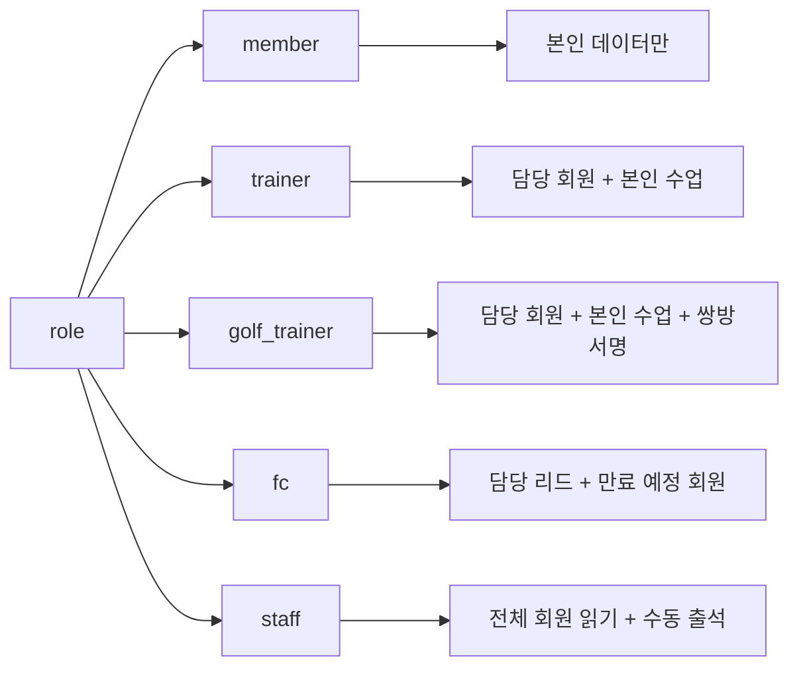

# R1. 회원앱 5개 role × 화면 권한 매트릭스

> 회원앱 role 키: `member / trainer / golf_trainer / fc / staff`
> 회원앱 role은 관리자웹 권한 키(`superAdmin / primary / owner / manager / fc / staff / readonly`)와 별도 체계.

## 매트릭스 (R = Read / W = Write / - = 접근 불가)

| 화면 ID | 화면명 | member | trainer | golf_trainer | fc | staff |
|---|---|:---:|:---:|:---:|:---:|:---:|
| MA-001 | 로그인 | RW | RW | RW | RW | RW |
| MA-002 | 앱 가입/연동 | RW | - | - | - | - |
| MA-100 | 회원 홈 | RW | - | - | - | - |
| MA-110 | QR 입장 | RW | - | - | - | - |
| MA-111 | 출석 이력 | R | R(담당 회원만) | R(담당) | R(담당) | R(전체) |
| MA-120~126 | 수업 예약 / 후기 | RW | R(담당) | R(담당) | - | R(전체) |
| MA-127/128 | 온보딩 | RW | - | - | - | - |
| MA-130 | 마이페이지 | RW | - | - | - | - |
| MA-131 | 이용권/잔여 회차 | R | R(담당) | R(담당) | R(담당) | R(전체) |
| MA-132 | 체성분/FMS | R | RW(담당) | RW(담당) | R(담당) | R(전체) |
| MA-133~142 | 결제 / 영수증 | RW | - | - | - | - |
| MA-150 | 알림센터 | RW | RW | RW | RW | RW |
| MA-151/152 | 센터 정보 / 공지 | R | R | R | R | R |
| MA-153 | 1:1 문의 | RW | - | - | RW | RW |
| MA-155~158 | 설정 / 약관 / 동의 / 탈퇴 | RW | RW | RW | RW | RW |
| MA-200~252 | 트레이너 홈/캘린더/회원관리 | - | RW | RW | - | - |
| MA-300~351 | 마켓 둘러보기 | RW | R | R | R | R |
| MA-400~405 | 결제 옵션 / 주문 / 환불 / 결제수단 | RW | - | - | - | - |
| MA-410~431 | FC 상담 / 만료 회원 | - | - | - | RW | - |
| MA-500~502 | 멤버십 등급 / 추천 / 활동 이력 | RW | - | - | - | - |
| MA-510/511 | 회원 조회 / 상세 | - | - | - | - | R(전체) |
| MA-520 | 수동 출석 | - | - | - | - | RW |
| MA-530 | 수업 일정 조회 | - | - | - | - | R |
| MA-600~603 | Q&A / FAQ / 신고 | RW | RW(답변) | RW(답변) | RW(답변) | - |
| MA-900~902 | 시스템 화면 | RW | RW | RW | RW | RW |

## 핵심 정책

| 정책 | 내용 |
|---|---|
| 단일 역할 | 한 계정은 하나의 회원앱 role만 갖는다 |
| 데이터 접근 범위 | member: 본인 / trainer·golf_trainer·fc: 담당 회원 / staff: 전체 회원 (읽기) |
| 결제 권한 | member만 결제 가능 |
| 본인 정보 수정 | member 본인만 (다른 회원 수정 불가) |
| 직원 → 회원 진입 차단 | trainer / fc / staff 계정으로 회원 화면 진입 불가 |

