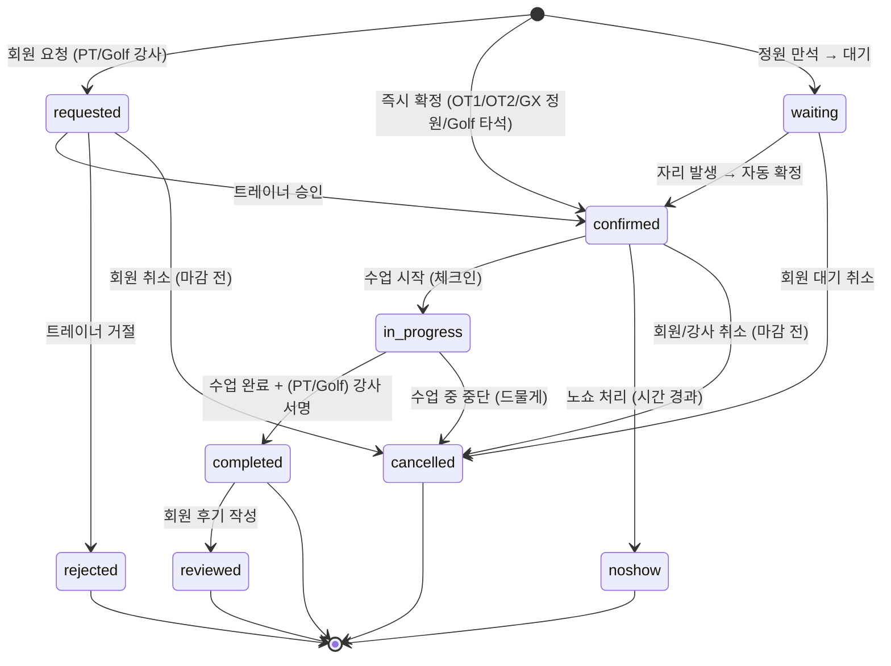

# S1. 예약 상태 전이도

> 회원앱 예약(PT / OT / GX / Golf) 상태 전이 흐름.

## 상태별 정의

| 상태 | 정의 | 다음 상태 |
|------|------|-----------|
| requested | 회원이 트레이너에게 예약 요청, 승인 대기 | confirmed / rejected / cancelled |
| confirmed | 예약 확정 | in_progress / cancelled / noshow |
| waiting | 정원 만석으로 대기열 등록 | confirmed (자동) / cancelled |
| rejected | 트레이너 거절 | [end] |
| cancelled | 회원 또는 강사 취소 | [end] |
| in_progress | 수업 시작 (체크인 또는 강사 시작) | completed / cancelled |
| completed | 수업 완료 (PT/Golf 강사 서명 포함) | reviewed |
| noshow | 회원 미참석 | [end] (페널티 누적) |
| reviewed | 회원이 MA-126 후기 작성 | [end] |

## 횟수 차감 시점

| 수업 유형 | 차감 시점 |
|---|---|
| PT | `completed` 시 PT 잔여 -1 |
| OT1 / OT2 | `completed` 시 OT 잔여 -1 |
| Golf 강사 레슨 | `completed` 시 골프 레슨권 -1 (쌍방서명 포함) |
| GX | 정원 카운트만, 회차 차감 없음 |
| Golf 타석 | 타석 이용권 -1 (`completed`) |

**예약 승인 / 일정 확정만으로 차감되지 않는다.**

## 노쇼 페널티

| 누적 | 처리 |
|---|---|
| 1회 | 경고 알림 |
| 3회 | 예약 제한 (센터 설정에 따라 1주 / 2주) |

## 취소 마감 정책

| 항목 | 내용 |
|---|---|
| 취소 마감 시간 | 수업 시작 N시간 전 (센터 설정, 기본 2시간) |
| 마감 후 취소 | 노쇼와 동일 처리 |
| 면제 | 강사 수동 면제 가능 (사고 / 질병 등) |
