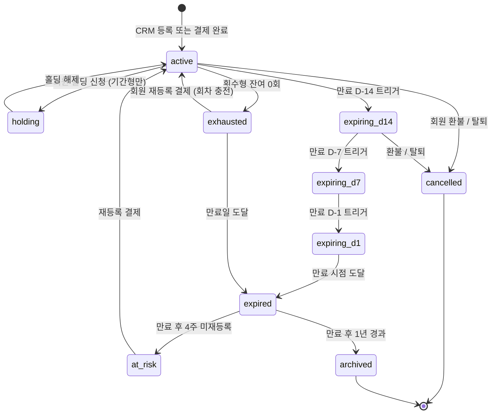
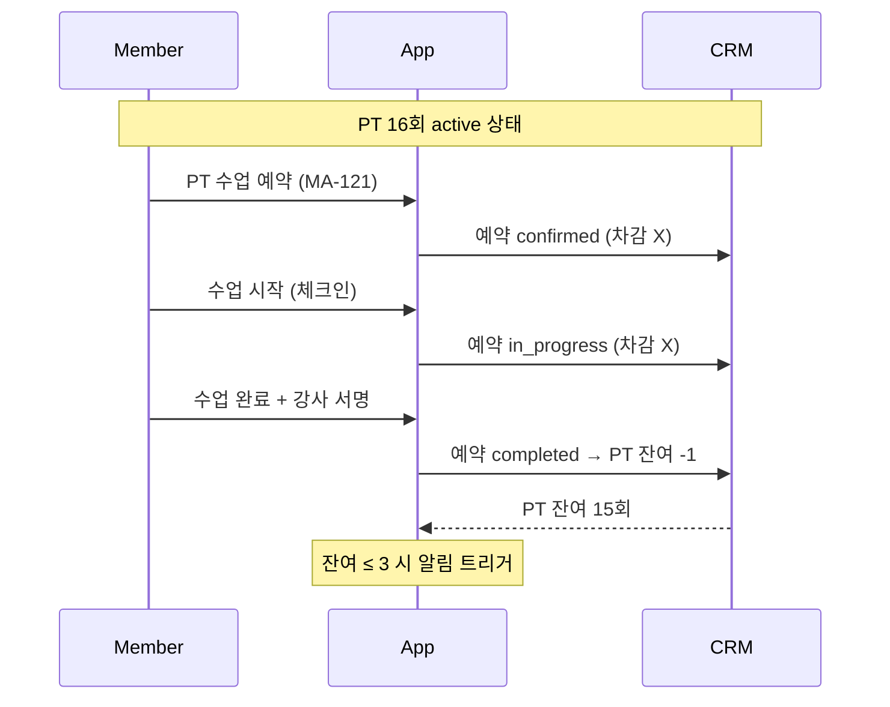

# S2. 이용권 상태 전이도

> 회원 이용권(회원권 / PT / OT / Golf 레슨권 / 락커 / 부가옵션) 상태 전이.

## 상태별 정의

| 상태 | 정의 | 회원 화면 표기 |
|------|------|---------------|
| active | 사용 가능 | "이용 중" |
| holding | 일시 정지 (기간형만) | "홀딩 중" |
| expiring_d14 | 만료 14일 전 | "만료 14일 전" + info 배너 |
| expiring_d7 | 만료 7일 전 | "이번 주 만료" + warning 배너 |
| expiring_d1 | 만료 1일 전 | "내일 만료" + danger 배너 |
| exhausted | 횟수 0 | "잔여 0회" + 재등록 추천 |
| expired | 만료됨 | "만료됨" + 재등록 추천 |
| at_risk | 만료 후 4주 미재등록 | "AT-RISK 케어 알림" |
| cancelled | 환불 / 탈퇴로 취소 | (회원 화면 비노출) |
| archived | 만료 후 1년 경과 | (회원 화면 비노출) |

## D-day 트리거 → 알림 / 화면 매핑

| 상태 | 알림 카테고리 | 화면 노출 |
|------|--------------|-----------|
| expiring_d14 | 이용권 (info) | MA-131 + MA-100 배너 + MA-138 추천 |
| expiring_d7 | 이용권 (warning) | MA-131 강조 + MA-100 배너 + MA-138 |
| expiring_d1 | 이용권 (danger) | MA-131 빨강 + MA-100 우선 + MA-138 강조 |
| exhausted | 이용권 (warning) | MA-131 회색 카드 + MA-138 강조 |
| at_risk | AT-RISK 케어 (warning) | MA-138 + MA-153 1:1 문의 |

## 회차 차감 / 충전 흐름

