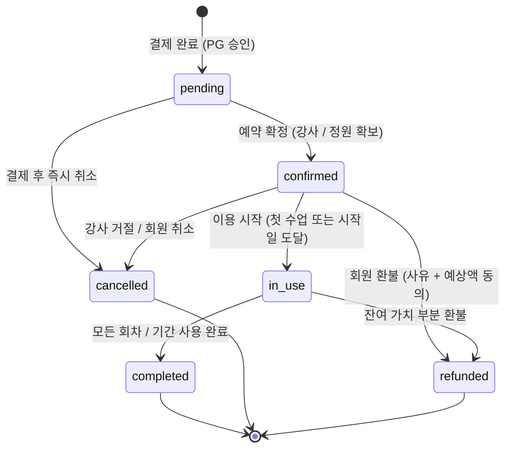
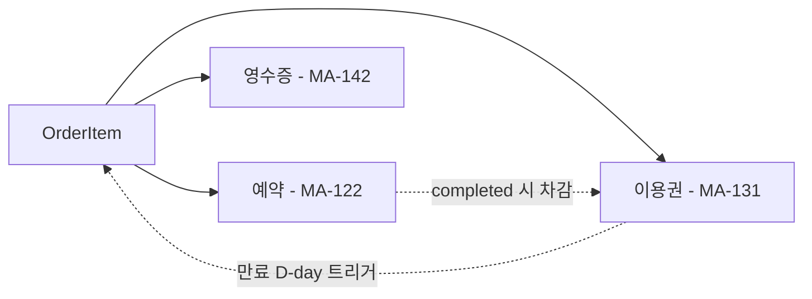

# S3. 주문(OrderItem) 상태 전이도

> 마켓 결제 후 생성되는 OrderItem의 4단계 timeline + 종료 상태.

## 4단계 timeline

| 단계 | 상태 | 회원 화면 (MA-403) |
|------|------|-------------------|
| 1 | pending | "결제 완료" 활성, 나머지 회색 |
| 2 | confirmed | "예약 확정" 활성, 그 다음 회색 |
| 3 | in_use | "이용 가능" 활성 + 잔여 회차 표시 |
| 4 | completed | "이용 완료" 활성 |
| 종료 | cancelled / refunded | 별도 종료 단계 분기 표시 |

## 상태별 회원 액션

| 상태 | 가능 액션 |
|------|-----------|
| pending | 주문 취소 / 환불 신청 / 영수증 |
| confirmed | 주문 취소 / 환불 신청 / 영수증 |
| in_use | 환불 신청 / 영수증 / 후기 미리보기 |
| completed | 후기 작성 / 영수증 |
| cancelled / refunded | 영수증만 |

## 환불 비율 정책

| 상품 유형 | 환불액 산정 |
|-----------|------------|
| 회차형 (PT 등) | 잔여 회차 / 총 회차 비율 |
| 기간형 (이용권) | 결제 후 7일 이내 100% / 30일 이내 70% / 30일 초과 30% |

## 주문 ↔ 예약 / 이용권 연결

