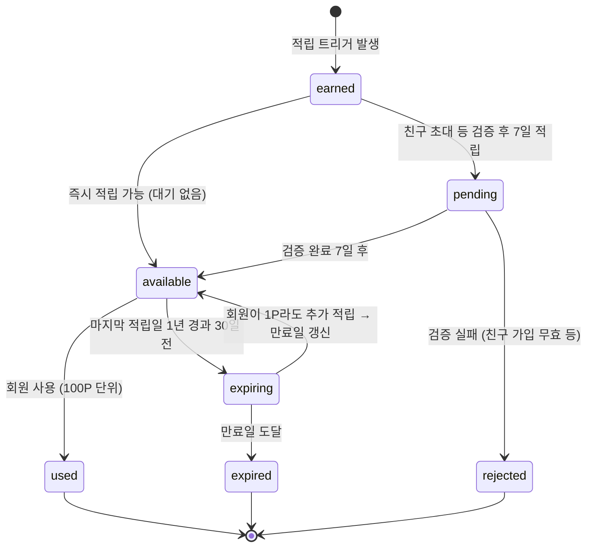
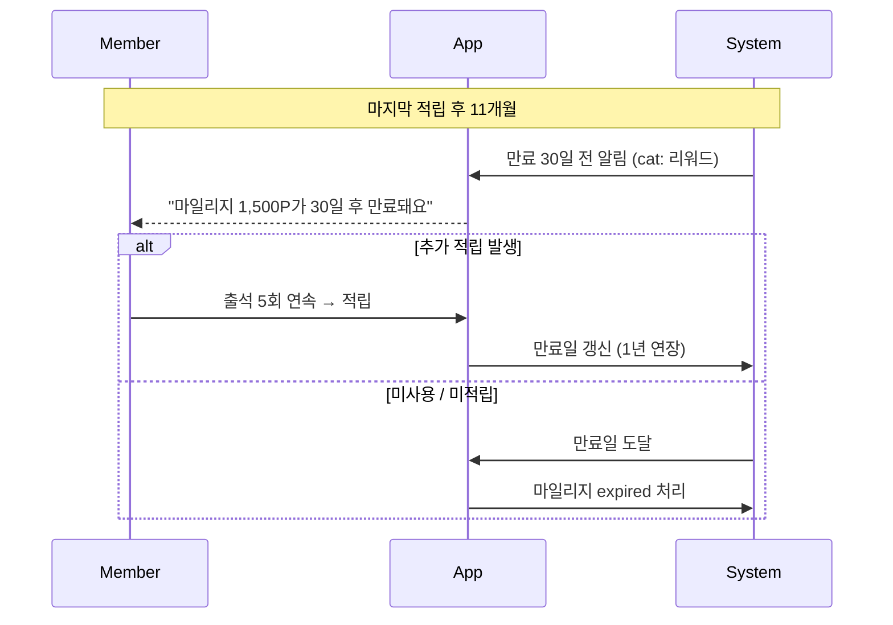

# S4. 마일리지 생명주기

> 회원 마일리지(=포인트) 적립 / 사용 / 만료 흐름.

## 적립 트리거 (정책 1.8)

| 트리거 | 적립 시점 | 예시 단가 |
|--------|-----------|-----------|
| 운동 루틴 완료 | 즉시 (`available`) | 50P |
| 출석 5회 연속 | 즉시 | 200P |
| 체성분 측정 | 즉시 | 100P |
| 스트레칭 이용 | 즉시 | 30P |
| 공개 후기 작성 | 즉시 | 100P |
| 친구 초대 ① 가입 | 7일 검증 (`pending`) | 5,000P |
| 친구 초대 ② 첫 결제 | 7일 검증 | 5,000P |
| 친구 초대 ③ 첫 후기 | 7일 검증 | 3,000P |

## 사용처 (정책 1.8)

| 사용처 | 차감 방식 |
|--------|-----------|
| 재등록 결제 차감 | 결제 화면에서 100P 단위 입력 |
| 리커버리(스트레칭/사우나) 결제 | 동일 |
| 굿즈 교환 | 굿즈별 고정 P |
| 마켓 결제 차감 | 결제 화면에서 100P 단위 입력 |

## 만료 정책

## 등급별 적립률 보너스

| 등급 | 보너스 |
|------|--------|
| BRONZE | 0% |
| SILVER | +5% |
| GOLD | +10% |
| VIP | +15% |
| VVIP | +20% |
