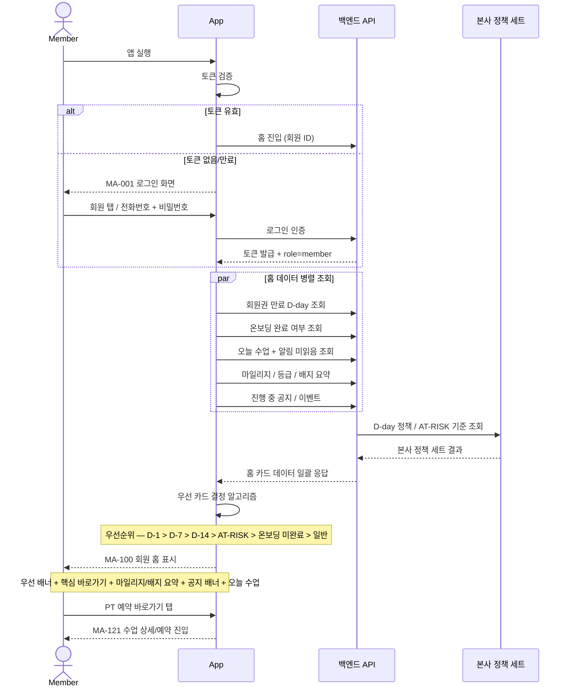

# X01. 홈 진입 분기 시나리오

> xlsx 항목: #1 로그인, #2 PT 예약 바로가기, #3 GX 스케줄 바로가기, Golf 스케줄 바로가기, #4 포인트/배지 요약, #5 공지/이벤트 배너

회원이 앱을 켜고 로그인 → 홈에 진입할 때 회원 상황(만료 임박 / 온보딩 미완료 / AT-RISK / 신규 알림)에 따라 우선 카드를 결정해 노출하는 흐름.

## 우선 카드 결정 로직

| 조건 | 우선 카드 |
|---|---|
| 회원권 만료 D-1 또는 만료 후 | MA-138 재등록 추천 (danger 배너) |
| 만료 D-7 | MA-138 (warning) |
| 만료 D-14 | MA-138 (info) |
| 4주 미방문 (AT-RISK) | MA-138 + AT-RISK 메시지 |
| 운동 온보딩 미완료 | MA-127 진입 안내 |
| 알림 미읽음 N건 | 헤더 알림 배지만 강조 |
| 일반 | 핵심 바로가기 (PT / GX / Golf) + 오늘 수업 |
