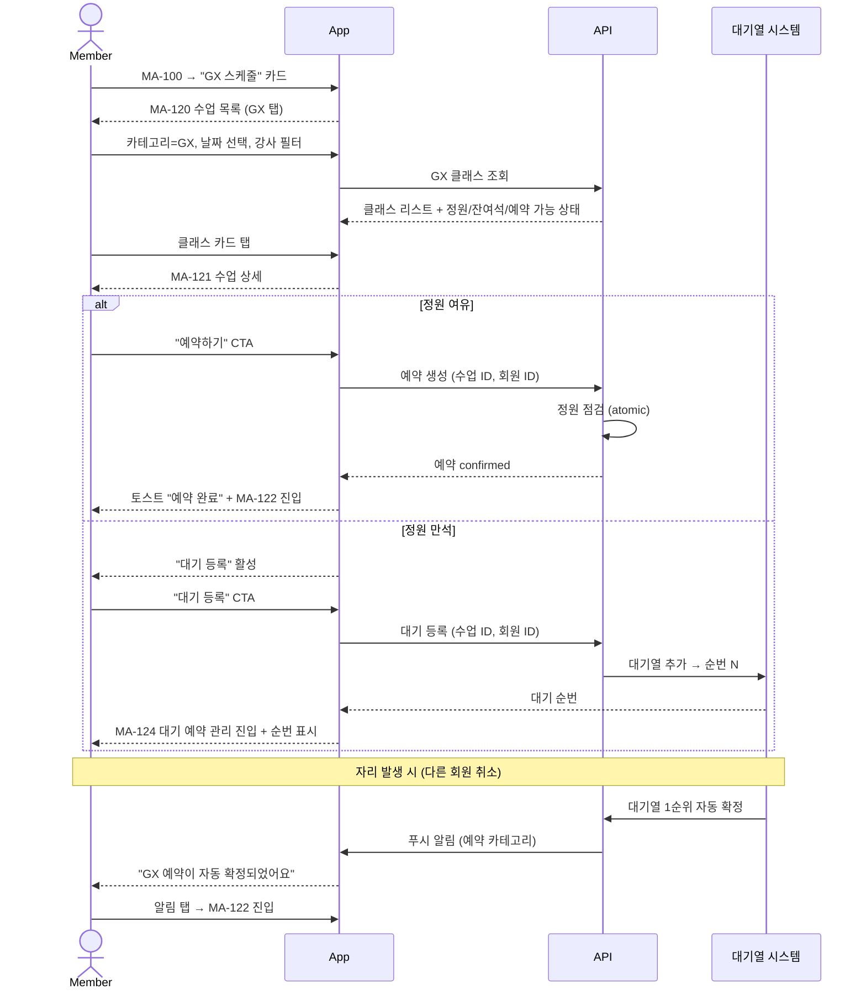

# X02. GX 예약 플로우 시나리오

> xlsx 항목: #12 오늘/주간 GX 스케줄, #13 GX 예약/취소, #14 정원·대기 상태

회원이 GX 클래스를 탐색·예약하거나 만석 시 대기 등록하는 흐름. 정원 자동 확정과 자리 발생 시 자동 확정 로직 포함.

## 정원 / 대기 정책

| 항목 | 정책 |
|---|---|
| 정원 점검 | atomic 처리 (동시 예약 시 충돌 방지) |
| 대기 등록 | 정원 만석 + 센터가 대기 허용 시 |
| 자동 확정 | 다른 회원 취소 / 노쇼 시 1순위 자동 확정 |
| 알림 발송 | 자동 확정 시 푸시 (예약 카테고리) |
| 대기 취소 | 회원 임의 취소 가능 |
