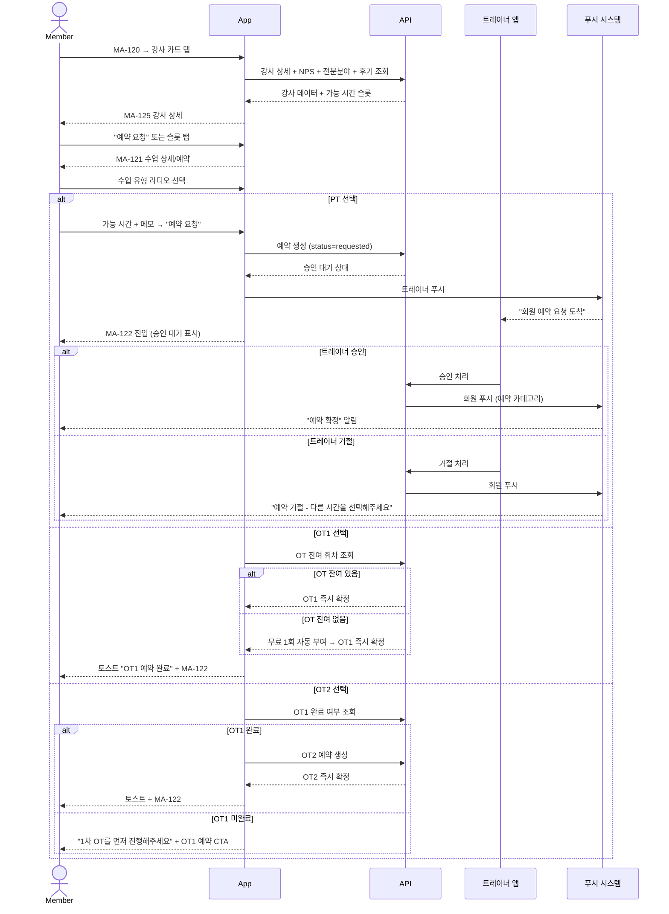
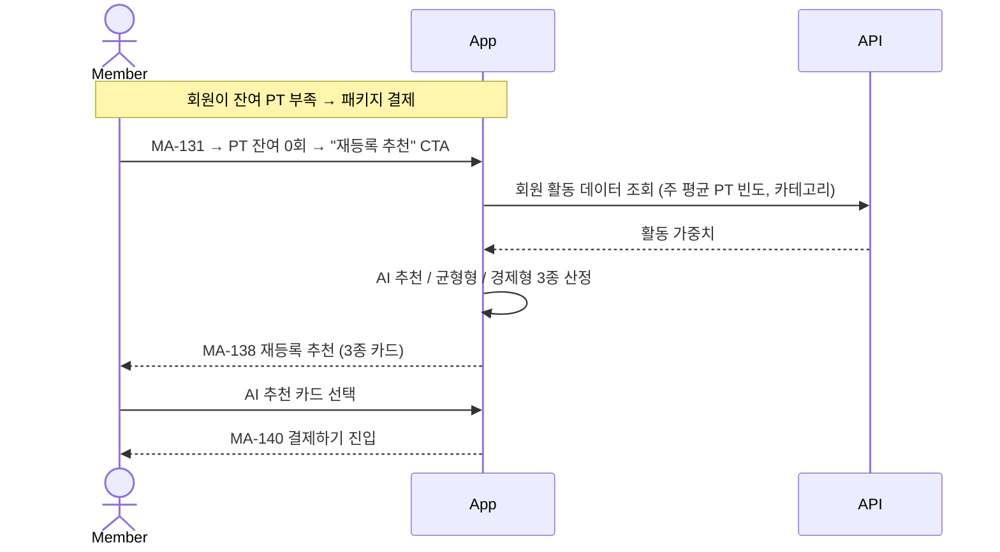

# X03. PT / OT1 / OT2 예약 분기 시나리오

> xlsx 항목: #15 강사 정보 + NPS, #18 트레이너 프로필/전문분야, #19 PT/OT1/OT2 예약, #20 PT 패키지 + AI 추천

회원이 강사 상세 → 가능 시간 확인 → PT/OT1/OT2 분기 예약하는 흐름. PT는 트레이너 승인 대기, OT1·OT2는 등록 직후 즉시 확정.

## PT 패키지 / AI 추천 진입

## NPS / 전문분야 / 후기 표기

| 표기 | 색상 분기 |
|---|---|
| NPS 70+ | promoter (초록) |
| NPS 30~69 | passive (회색) |
| NPS 30 미만 | detractor (빨강) |
| 별점 평균 | 5점 만점 + 후기 수 |
| 전문분야 칩 | 다이어트 / 체형교정 / 통증관리 / 근비대 / 재활 / 자세교정 / 골프 스윙 / 골프 퍼팅 / 필라테스 / 요가 |
