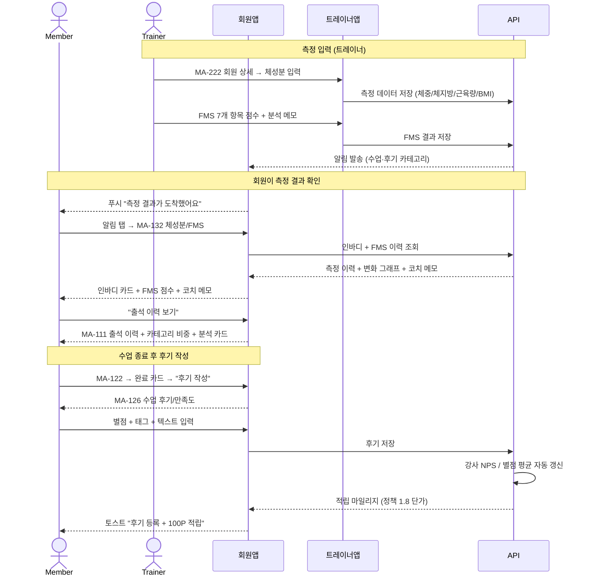

# X04. 체성분 / FMS 측정 확인 시나리오

> xlsx 항목: #10 인바디 리포트, #11 FMS/체형 리포트, #16 출석/참여 히스토리, #17 만족도 평가

회원이 OT2(FMS 측정) 또는 정기 측정 후 인바디·FMS 리포트를 확인하고, 트레이너 안내 메모를 함께 본다. 수업 후 만족도 평가 흐름 포함.

## FMS 점수 안내

| 총점 (0~21) | 분석 |
|---|---|
| 14점 이상 | 양호 (운동 강도 자유) |
| 11~13점 | 보통 (특정 동작 주의) |
| 10점 이하 | 주의 (코치 안내 필수) |

## 후기 → 적립 / 통계 반영

| 항목 | 결과 |
|---|---|
| 후기 작성 | 마일리지 100P 적립 (정책 1.8) |
| 별점 5점 / 텍스트 50자+ | 마일스톤 배지 후보 |
| 강사 NPS | 회원의 추천 의향 점수로 NPS 재계산 |
| 강사 별점 | 5점 평균 자동 갱신 |
