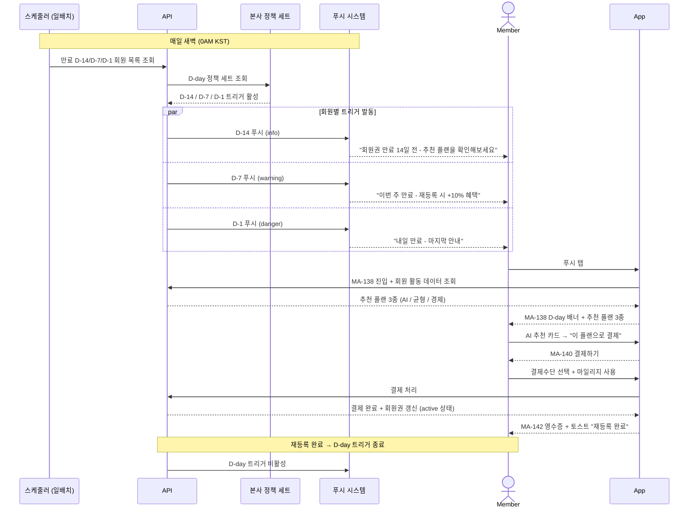
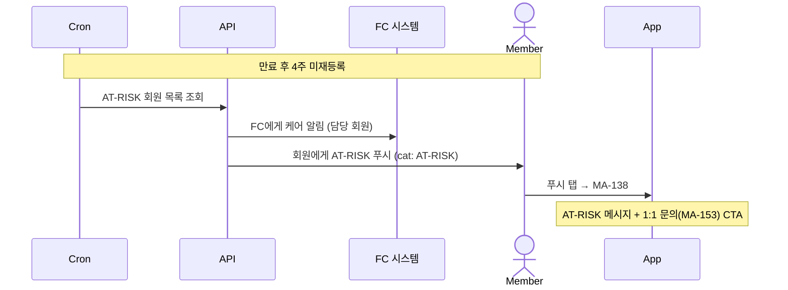

# X05. 재등록 D-day 트리거 시나리오

> xlsx 항목: #25 재등록 추천 플랜 3종 (D-14/D-7/D-1)

회원권 만료 14일/7일/1일 전에 본사 정책 세트 기반 자동 트리거가 발동, 회원에게 푸시 + 홈 배너 + MA-138 진입을 유도하는 흐름.

## D-day 트리거 매트릭스

| D-day | 알림 톤 | 푸시 횟수 | 홈 배너 | MA-138 표시 |
|-------|---------|-----------|---------|-------------|
| D-14 | info | 1회 | 보조 톤 | 기본 |
| D-7 | warning | 1회 | 강조 톤 | 강조 |
| D-1 | danger | 1회 | 빨강 톤 | 최우선 |
| 만료 후 | warning | 4주 후 1회 | AT-RISK 메시지 | + 1:1 문의 |

## AT-RISK 케어 시나리오

