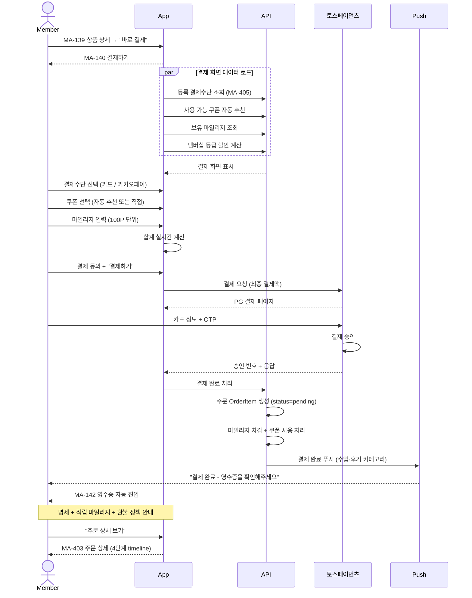
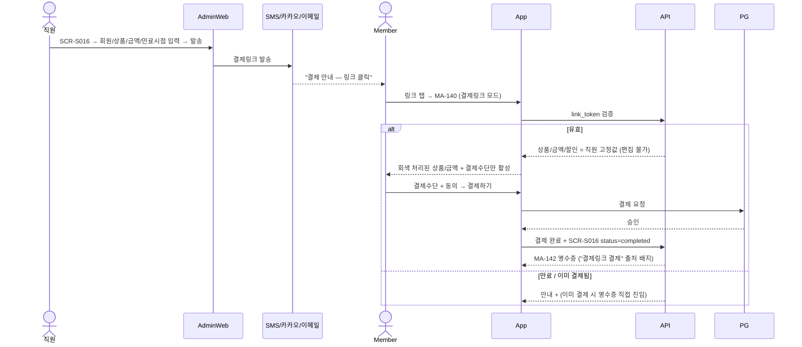
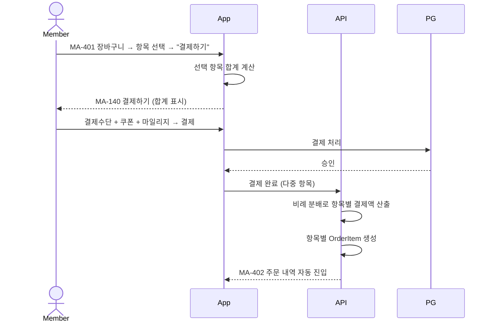

# X06. 결제 / 영수증 플로우 시나리오

> xlsx 항목: #26 결제수단 선택·결제, #27 결제 내역 확인

회원이 상품/패키지/이용권을 결제하고 영수증을 확인하는 흐름. 단건/장바구니/재등록 분기 + 마일리지/쿠폰 적용.

## 결제 합계 계산 순서

1. 상품 합계 (정가 × 수량)
2. 멤버십 등급 할인 적용 (BRONZE 0% ~ VVIP 20%)
3. 쿠폰 할인 적용 (1장만, 최소 결제액 검증)
4. 마일리지 차감 (100P 단위)
5. 최종 결제액 = 위 4단계 합산

## 관리자 발송 결제링크 (admin SCR-S016 → MA-140 재사용)

**결제링크 핵심 정책**

- 회원이 변경 가능한 항목: 결제수단 선택 + 결제 동의
- 변경 불가: 상품 / 금액 / 할인 / 쿠폰 / 마일리지
- 만료: 직원이 admin에서 설정 (기본 24시간)
- 영수증: "결제링크 결제" 출처 배지 + 발송 직원 정보 노출

## 장바구니 다중 결제 (비례 분배)

