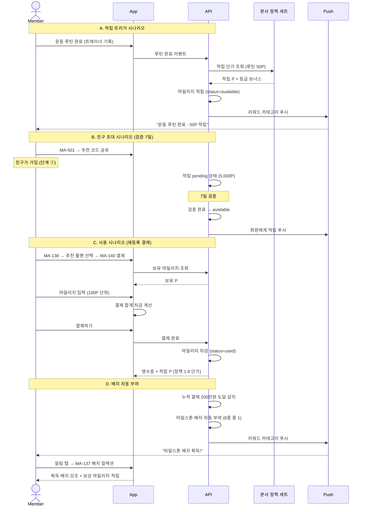

# X07. 마일리지 적립 / 사용 시나리오

> xlsx 항목: #22 포인트 내역 조회, #23 포인트 사용, #24 배지 목록/조건

회원의 활동 트리거(루틴 / 출석 / 측정 / 후기 / 친구 초대) 시 마일리지 자동 적립 + 회원이 사용처(재등록 / 리커버리 / 굿즈 / 마켓 결제)에서 차감하는 흐름.

## 적립 트리거 매트릭스 (정책 1.8)

| 트리거 | 적립 시점 | 단가 | 비고 |
|---|---|---|---|
| 운동 루틴 완료 | 즉시 | 50P | 트레이너 기록 시 |
| 출석 5회 연속 | 즉시 | 200P | 카운터 자동 |
| 체성분 측정 | 즉시 | 100P | 트레이너 입력 시 |
| 스트레칭 이용 | 즉시 | 30P | 부가시설 이용 |
| 공개 후기 작성 | 즉시 | 100P | MA-126 후기 등록 시 |
| 친구 초대 ① 가입 | 7일 검증 | 5,000P | 친구 가입 후 7일 |
| 친구 초대 ② 첫 결제 | 7일 검증 | 5,000P | 친구 첫 결제 후 7일 |
| 친구 초대 ③ 첫 후기 | 7일 검증 | 3,000P | 친구 첫 후기 후 7일 |

## 사용처 매트릭스

| 사용처 | 진입 화면 | 차감 방식 |
|---|---|---|
| 재등록 결제 | MA-138 → MA-140 | 100P 단위 입력 |
| 리커버리 결제 (스트레칭/사우나) | MA-141 → MA-140 | 동일 |
| 굿즈 교환 | (외부 운영) | 굿즈별 고정 P |
| 마켓 결제 | MA-134 → MA-400 → MA-140 | 동일 |
