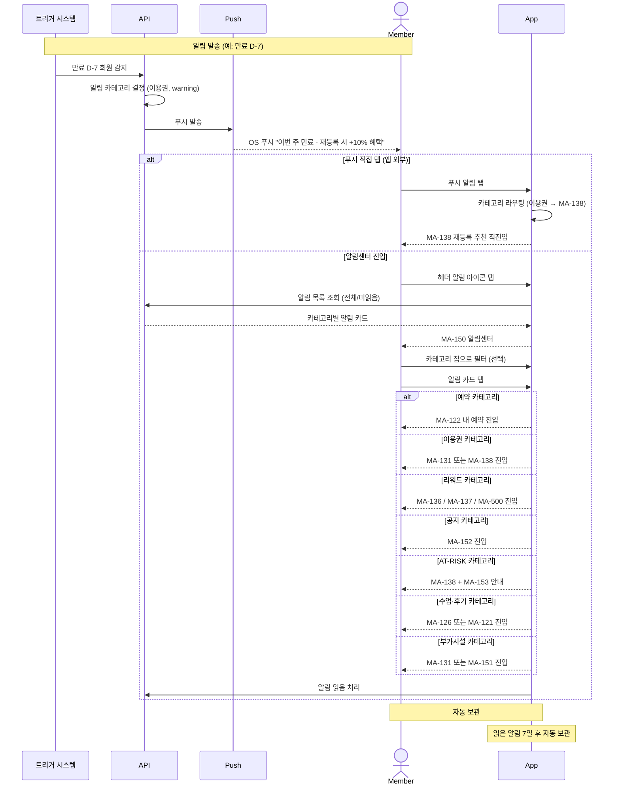
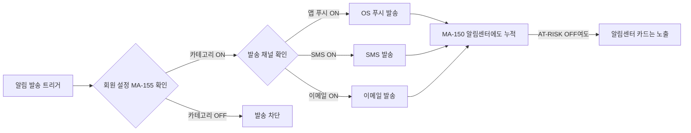

# X08. 알림 / 라우팅 시나리오

> xlsx 항목: #34 모든 알림 보기, #35 알림 상세 액션

회원에게 발송되는 7개 카테고리 알림이 알림센터(MA-150)에 누적되고, 카드 탭 시 정의된 라우팅 표에 따라 대상 화면으로 이동하는 흐름.

## 카테고리 → 화면 라우팅 매핑 (정책 1.10)

| 카테고리 | 색상 | 라우팅 대상 |
|----------|------|-------------|
| 예약 | primary | MA-122 |
| 이용권 | warning | MA-131 / MA-138 |
| 리워드 | success | MA-136 / MA-137 / MA-500 |
| 공지 | neutral | MA-152 |
| AT-RISK 케어 | danger | MA-138 / MA-153 |
| 수업·후기 | secondary | MA-121 / MA-126 |
| 부가시설 | info | MA-131 / MA-151 |

## 카테고리별 ON/OFF + 채널

